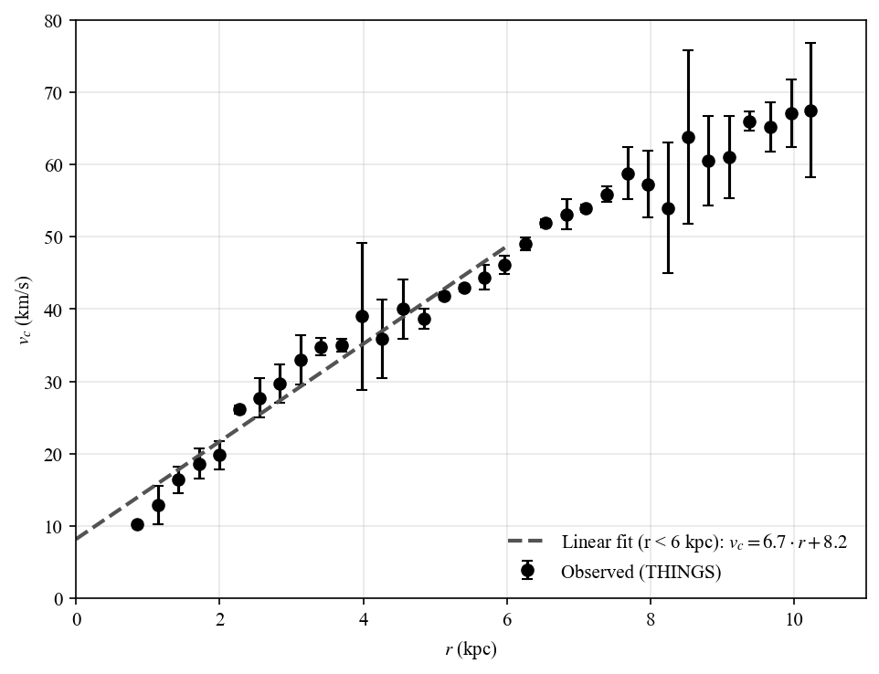
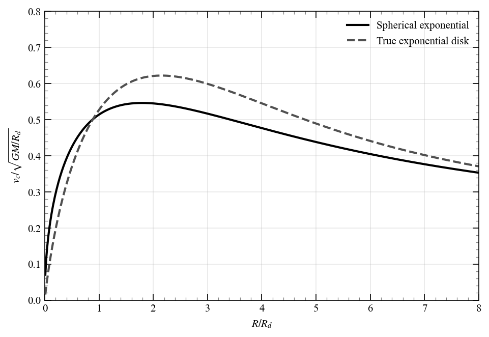
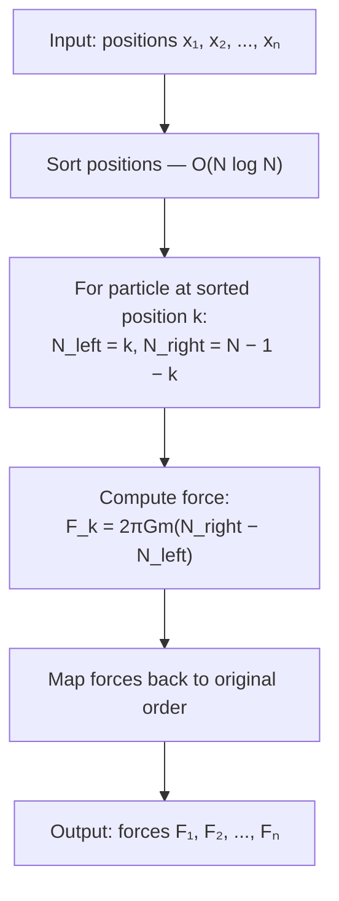
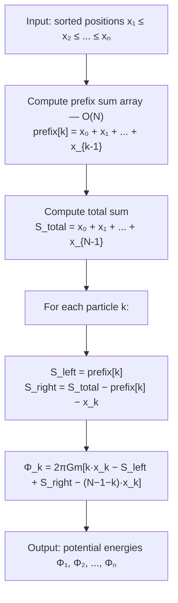

# Chapter 2: Gravitation

<!-- ======================= -->
<!-- PROBLEM 2.1             -->
<!-- ======================= -->
## Problem 2.1

For a homogeneous sphere $v_c \sim r$

$$
v_c(r) = \sqrt{\frac{4\pi G \rho_0}{3}} r
$$



*Figure 2.1: Data from the THINGS survey [@deblok2008] shows that the circular velocity rises approximately linearly with radius for $r < 6$ kpc. Linear fit shown in dashed line.*

$$v_c \approx 6.75 \cdot r + 8.18 \text{ km/s}$$

with $R^2 = 0.949$, from this we can estimate the central density of IC 2574 as

$$
\rho_0 = \frac{3}{4 \pi G} \left(\frac{v_c}{r}\right)^2 \approx 1.27 \times 10^7 M_\odot \text{ kpc}^{-3}
$$

Script to generate figure:

```python
from galactic_dynamics_bovy.chapter02.ic_2574 import plot_rotation_curve
plot_rotation_curve()
```

<!-- ======================= -->
<!-- PROBLEM 2.2             -->
<!-- ======================= -->
## Problem 2.2

### Numerical solution

The connection between virial radius $r_{\mathrm{vir}}$, virial mass $M_{\mathrm{vir}}$, and overdensity $\Delta_v$ is

$$
\frac{3\rho_0}{c^3}f(c) = \Delta_v \rho_{\mathrm{crit}} \quad f(c) = \ln(1+c) - \frac{c}{1+c} \quad r_{\mathrm{vir}} = c a,
$$

or equivalently

$$
\frac{3f(c)}{c^3} = y \quad y = \frac{\Delta_v \rho_{\mathrm{crit}}}{\rho_0}.
$$

The expression $r_{\mathrm{vir}} = a c(y)$ then gives the virial radius as a function of overdensity $\Delta_v$. However, there is no closed-form solution for $c(y)$, so we must solve numerically.


*Figure 2.2: Virial mass (top) and virial radius (bottom) as a function of overdensity $\Delta_v$ for an NFW halo with $\rho_0 = 3.5 \times 10^6\,M_\odot/\mathrm{kpc}^3$ and scale radius $a = 16$ kpc. At $\Delta_v = 200$, this halo has $r_{\mathrm{vir}} \approx 95$ kpc and $M_{\mathrm{vir}} \approx 2 \times 10^{11}\,M_\odot$.*

Script to generate figure:

```python
from galactic_dynamics_bovy.chapter02.rvir_mvir import plot_rvir_mvir_delta
plot_rvir_mvir_delta()
```

That being said, there are reasonable approximations for $c(y)$ at high and low $y$:

### Small overdensity

In this regime

$$
\begin{align}
f(c) &= \ln(1+c) - \frac{c}{1+c} \\
&= \left(c - \frac{c^2}{2} + \frac{c^3}{3} - \ldots\right) - \left(c - c^2 + c^3 - \ldots\right) \\
&= \frac{c^2}{2} - \frac{2 c^3}{3} + \mathcal{O}(c^4)
\end{align}
$$

such that

$$
\frac{2f(c)}{c^3} = \frac{3}{2c} - 2 + \mathcal{O}(c).
$$

To leading order

$$
c \approx \frac{3}{2y},
$$

or equivalently

$$
r_{\mathrm{vir}} \approx \frac{3a}{2y} = \frac{3a \rho_0}{2 \Delta_v \rho_{\mathrm{crit}}} \sim \Delta_v^{-1}
$$

### Large overdensity
In this regime

$$
\begin{align}
f(c) &= \ln(1+c) - \frac{c}{1+c} \\
&= \ln c - 1 + \mathcal{O}(1/c)
\end{align}
$$

therefore

$$
c^3 \sim \frac{2\ln c}{y} \implies c \sim \left(\frac{2 \ln c}{y}\right)^{1/3}
$$

Up to a logarithmic correction, we have

$$
r_{\mathrm{vir}} \sim c \sim y^{-1/3} \sim \Delta_v^{-1/3}
$$

In summary, we have

$$
r_{\mathrm{vir}} \sim \begin{cases}\Delta_v^{-1}, & \Delta_v \ll 1 \\ \Delta_v^{-1/3}, & \Delta_v \gg 1\end{cases}
$$

### Intuition behind the scaling

If $\rho(r) \sim r^{-\gamma}$ then $M(<r) \sim r^{3-\gamma}$, and $\overline{\rho}(<r) \sim r^{-\gamma}$. Setting $\overline{\rho}(<r) = \Delta_v \rho_{\mathrm{crit}}$ gives the scaling of $r_{\mathrm{vir}}$ with $\Delta_v$.

$$
r_{\mathrm{vir}} \sim \Delta_v^{-1/\gamma}
$$

The NFW profile has $\gamma \approx 1$ at small $r$ and $\gamma \approx 3$ at large $r$, giving the scalings derived above. The reason for the scaling is then the two-power nature of the NFW profile.

!!! note "Milky Way NFW Parameters"

    Recent estimates of the Milky Way's virial mass span a wide range. Using Gaia DR3 data, [@wang2023] found $M_{\mathrm{vir}} = (6.5 \pm 0.3) \times 10^{11}\,M_\odot$ with concentration $c \approx 14.5$ for an NFW model. Earlier work by [@eilers2019] estimated $M_{\mathrm{vir}} = (7.25 \pm 0.25) \times 10^{11}\,M_\odot$. Studies using globular clusters [@posti2019] suggest a higher mass of $M_{\mathrm{vir}} = (1.3 \pm 0.3) \times 10^{12}\,M_\odot$.

<!-- ======================= -->
<!-- PROBLEM 2.3             -->
<!-- ======================= -->
## Problem 2.3

For a logarithmic potential

$$
M(<r) = \frac{r^2}{G} \frac{d\Phi}{dr} = \frac{r v_{c,0}^2}{G}.
$$

The average density within $r$ is then

$$
\rho(<r) = \frac{3 v_{c,0}^2}{4 \pi G r^2}.
$$

Setting this equal to $\Delta_v \rho_{\mathrm{crit}}$ and solving for $r$ gives

$$
r_v^2 = \frac{3 v_{c,0}^2}{4 \pi G \Delta_v \rho_{\mathrm{crit}}} = \frac{2}{\Delta_v} \left(\frac{v_{c,0}}{H_0}\right)^2.
$$

In the logarithmic potential $v_c(r) = v_{c,0}$. Taking $\Delta_v = 200$, we then have

$$
v_{c,0} = v_{200} = 10 H_0 r_{200}.
$$

<!-- ======================= -->
<!-- PROBLEM 2.4             -->
<!-- ======================= -->
## Problem 2.4

!!! question "$r_{\mathrm{vir}}$ vs $M_{\mathrm{vir}}$ Scaling"

    The relation between virial mass and virial radius is $M_{\mathrm{vir}} = 4\pi \Delta_v \rho_{\mathrm{crit}} r_{\mathrm{vir}}^3/3$, which is *independent* of the density profile. In particular, it does not depend on any potential scaling relation between virial mass and concentration.

<!-- ======================= -->
<!-- PROBLEM 2.5             -->
<!-- ======================= -->
## Problem 2.5


### Mass profile
For a density profile of the form

$$
\rho(r) = \rho_0 \frac{1}{(r/a)^2 (1 + r/a)^{2}},
$$

the mass profile is

$$
\begin{align}
M(<r) &= 4 \pi \int_0^r dr'\, r'^2 \rho(r')  \\
&= 4 \pi \rho_0 a^3 \int_0^{r/a} dx\, \frac{1}{(1+x)^2} \\
&= 4 \pi \rho_0 a^2 \frac{r}{1+r/a} \tag{2.5.1}
\end{align}
$$

and the potential (using $\Phi(r) = $)

$$
\begin{align}
\Phi(r) &= -\frac{GM(<r)}{r} - 4\pi G \int_r^\infty dr'\, r' \rho(r') \\
&= -4\pi G \rho_0 a^2 \ln\left(1 + \frac{a}{r}\right)
\end{align}
$$

Circular velocity is then

$$
v_c^2 = r \frac{d\Phi}{dr} = \frac{4\pi G \rho_0 a^2}{1 + r/a} \tag{2.5.2}
$$

### Circular velocity


*Figure 2.5: Normalized circular velocity as a function of $r/a$ for Jaffe, Hernquist, and NFW profiles. The Jaffe profile has a monotonically decreasing rotation curve, while Hernquist and NFW rise at small radii before declining.*

Script to generate figure:

```python
from galactic_dynamics_bovy.chapter02.vcirc_profiles import plot_vcirc_profiles
plot_vcirc_profiles()
```

### Hernquist vs. Jaffe

The total mass of the Jaffe profile is

$$
\lim_{r \to \infty} M(<r) \stackrel{(2.5.1)}{=} 4 \pi \rho_0 a^3
$$

And the gravitational potential for a Hernquist profile is

$$
\Phi_{\mathrm{Hernquist}}(r) = -\frac{4 \pi G \rho_0 a^2}{1 + r/a}. \tag{2.5.3}
$$

Comparing (2.5.3) and (2.5.2) we see that the potential of a Hernquist profile with mass $M = 4\pi \rho_{0,\mathrm{Hernquist}} a_{\mathrm{Hernquist}}^3$ matches the negative of the circular velocity squared profile of the Jaffe profile with mass $M = 4\pi \rho_{0,\mathrm{Jaffe}} a_{\mathrm{Jaffe}}^3$.

<!-- ======================= -->
<!-- PROBLEM 2.6             -->
<!-- ======================= -->
## Problem 2.6

### Total mass

There are various ways to approach this problem.

**First method**

From Poisson's equation

$$
\begin{align}
M_{\mathrm{tot}} &= \int d^3r \, \rho(r) = \frac{1}{4\pi G}\int d^2\mathbf{S} \cdot \nabla \Phi \\
&= \frac{1}{G} \lim_{r \to \infty} r^2 \frac{d\Phi}{dr} = 4\pi \rho a^2 \lim_{r \to \infty} r^2\frac{a/r^2}{1 + a / r} \\
&= 4\pi \rho_0 a^3
\end{align}
$$

**Second method**

Since $\Phi(r) \to 0$ at infinitu, we can write the monopole term of the potential as

$$
\Phi(r) \sim -G\frac{M_{\mathrm{tot}}}{r} = -4\pi G \rho_0 a^2 \frac{a}{r}
$$

from which we again find $M_{\mathrm{tot}} = 4\pi \rho_0 a^3$.

### Power-law behavior

In spherical coordinates

$$
\rho(r) = \frac{1}{4\pi G}\nabla^2 \Phi = \frac{1}{4\pi G r^2} \frac{d}{dr} \left(r^2 \frac{d\Phi}{dr}\right).
$$

If $\phi(r) \sim A r^\alpha$ for large $r$, then

$$
\rho(r) \sim \frac{A \alpha (\alpha + 1)}{4\pi G} r^{\alpha - 2},
$$

so the density behaves as $\rho(r) \sim r^{\alpha - 2}$. What we need to do is to find the power-law behavior of the potential, which is just

$$
\Phi(r) \sim -4\pi G \rho_0 a^2 \frac{a}{r} \quad \Rightarrow \quad \alpha = -1.
$$

therefore $\rho(r) \sim r^{-3}$ at large $r$.

<!-- ======================= -->
<!-- PROBLEM 2.7             -->
<!-- ======================= -->
## Problem 2.7

For an exponential disk the enclosed mass profile is

$$
M(<R) = 2\pi \int_0^R dR' \, R' \Sigma(R') = M \left[1 - \left(1 + \frac{R}{R_d}\right) e^{-R/R_d}\right].
$$

Define the "spherical exponential disk" as the spherical distribution function with the same enclosed mass profile

$$
M(<r) = M \left[1 - \left(1 + \frac{r}{R_d}\right) e^{-r/R_d}\right].
$$

This corresponds to a density profile

$$
\rho(r) = \frac{1}{4\pi r^2} \frac{dM(<r)}{dr} = \frac{M}{4\pi R_d^3} e^{-r/R_d}.
$$

And the potential is

$$
\begin{align}
\Phi(r) &= -\frac{GM(<r)}{r} - 4\pi G \int_r^\infty dr' \, r' \rho(r') \\
&= -\frac{GM}{r} \left[1 - \left(1 + \frac{r}{R_d}\right) e^{-r/R_d}\right] - G \frac{M}{R_d} e^{-r/R_d} \\
&= -\frac{GM}{r} \left[1 - e^{-r/R_d}\right]
\end{align}
$$

The circular velocity is then

$$
v_c^2(r) = r \frac{d\Phi}{dr} = \frac{GM}{r} \left[1 - \left(1 + \frac{r}{R_d}\right) e^{-r/R_d}\right].
$$

For comparison, the circular velocity of a true exponential disk (Freeman 1970) is

$$
v_c^2(R) = 4\pi G \Sigma_0 R_d \, y^2 \left[I_0(y)K_0(y) - I_1(y)K_1(y)\right], \quad y = \frac{R}{2R_d}
$$

where $I_n$ and $K_n$ are modified Bessel functions.



*Figure 2.7: Normalized circular velocity as a function of $R/R_d$ for the spherical exponential disk (solid) and the true exponential disk (dashed). The spherical approximation peaks at smaller radius than the true disk.*

Script to generate figure:

```python
from galactic_dynamics_bovy.chapter02.spherical_exponential import plot_exponential_vcirc
plot_exponential_vcirc()
```

<!-- ======================= -->
<!-- PROBLEM 2.8             -->
<!-- ======================= -->
## Problem 2.8

### Potential

Consider a 1D mass distribution $\rho(x) = A\delta(x)$,

$$
m = \int_{-\infty}^\infty dx \, \rho(x) = A.
$$

Constant $A$ is therefore the total mass of the distribution. The 1D Poisson equation is

$$
\frac{d^2 \Phi}{dx^2} = 4\pi G m \delta(x).
$$

Away from $x=0$ the this equation is homogenous, so the potential is linear in $x$.

$$
\Phi(x) = \begin{cases}a x + b, & x < 0 \\ -ax + b, & x > 0\end{cases} \tag{2.8.1}
$$

where symmetry and continuity are used to set the coefficients. Now, let's integrate the Poisson equation across $x=0$:

$$
\begin{align}
\int_{-\epsilon}^{\epsilon} dx \, \frac{d^2 \Phi}{dx^2} &= 4\pi G m \int_{-\epsilon}^{\epsilon} dx \, \delta(x) \\
&= 2a = 4\pi G m
\end{align}
$$

The potential is therefore

$$
\Phi(x) = 2\pi G m |x|.
$$

Where I dropped the constant $b$ since it is physically irrelevant. The force is then

$$
F(x) = -\frac{d\Phi}{dx} = -2\pi G m \, \mathrm{sgn}(x).
$$

### N-body simulation


For an $N$-body simulation with $N$ particles of equal mass $m$, the force on particle $i$ is

$$
F_i = 2\pi G m (N_i^+ - N_i^-),
$$

where $N_i^+$ and $N_i^-$ are the number of particles to the right and left of particle $i$. This can be computed in $\mathcal{O}(N \log N)$ time by sorting the particles.




For a uniform distribution on $[-1/2, 1/2]$ with total mass $M$, the theoretical force is

$$
F(x) = -4\pi G M x.
$$


*Figure 2.8: Comparison of numerical vs theoretical gravitational force for $N = 10000$ particles uniformly distributed on $[-1/2, 1/2]$. The error $(F_{\mathrm{numerical}} - F_{\mathrm{theory}}) / (4 \pi G M)$ stays close to zero across the distribution.*

Script to generate figure:

```python
from galactic_dynamics_bovy.chapter02.nbody_1d import plot_force_comparison
plot_force_comparison()
```

### Energy

To calculate the forces we already sorted the particles. The potential energy of particle $i$ is:

$$
\Phi_i = 2\pi G m \sum_{j \neq i} |x_i - x_j|
$$

For a particle at sorted position $k$, this splits into:

$$
\Phi_k = 2\pi G m \left[ \sum_{j<k} (x_k - x_j) + \sum_{j>k} (x_j - x_k) \right]
$$

This can be rewritten as:

$$
\Phi_k = 2\pi G m \left[ k \cdot x_k - S_{\text{left}}(k) + S_{\text{right}}(k) - (N-1-k) \cdot x_k \right]
$$

where:
- $S_{\text{left}}(k) = \sum_{j<k} x_j$ (sum of positions to the left)
- $S_{\text{right}}(k) = \sum_{j>k} x_j$ (sum of positions to the right)

The trick: compute a prefix sum array once in $\mathcal{O}(N)$:

```python
prefix[k] = x[0] + x[1] + ... + x[k-1]
```


Then:

- $S_{\text{left}}(k) = \texttt{prefix}[k]$
- $S_{\text{right}}(k) = \texttt{totalsum} - \texttt{prefix}[k] - x_k$

Each particle's potential energy is then computed in $\mathcal{O}(1)$, giving $\mathcal{O}(N)$ total.



<!-- ======================= -->
<!-- PROBLEM 2.9             -->
<!-- ======================= -->
## Problem 2.9


### Mass, potential, and circular velocity
Call the mass-to-light ratio $\Upsilon = M/L$, the density is

$$
\rho(x) = \frac{\Upsilon I_0}{2a} \frac{1}{(1 + r^2 / a^2)^{3/2}}.
$$

The mass profile is

$$
\begin{align}
M(<r) &= 4\pi \int_0^r dr' \,r'^2 \rho(r') \\
&= 2\pi \Upsilon I_0 a^2 \int_0^{r/a} dx \, \frac{x^2}{(1 + x^2)^{3/2}} \\
&= 2\pi \Upsilon I_0 a^2 \left[\mathrm{arcsinh}(r/a) - \frac{r/a}{(1 + r^2/a^2)^{1/2}}\right] \tag{2.9.1}
\end{align}
$$

The gravitational potential is

$$
\begin{align}
\Phi(r) &= -\frac{GM(<r)}{r} - 4\pi G \int_r^\infty dr' \, r' \rho(r') \\
&= -\frac{2\pi G \Upsilon I_0 a^2}{r} \left[\mathrm{arcsinh}(r/a) - \frac{r/a}{(1 + r^2/a^2)^{1/2}}\right] -2\pi G \Upsilon I_0 a^2 \left[\frac{1}{(1 + r^2/a^2)^{1/2}}\right] \\
&= - \frac{2\pi G \Upsilon I_0 a^2}{r} \mathrm{arcsinh}(r/a) \tag{2.9.2}
\end{align}
$$

and the circular velocity is

$$
v_c^2(r) = r \frac{d\Phi}{dr} = \frac{2\pi G \Upsilon I_0 a^2}{r} \left[\mathrm{arcsinh}(r/a) - \frac{r/a}{(1 + r^2/a^2)^{1/2}}\right]. \tag{2.9.3}
$$

### Limiting behaviors

For $x \gg 1$ we have

$$
\begin{align}
\mathrm{arcsinh}(x) = \ln (2x) + \frac{1}{4x^2} + \mathcal{O}(x^{-4}) \\
\frac{x}{(1 + x^2)^{1/2}} = 1 - \frac{x^2}{2} + \mathcal{O}(x^{-4})
\end{align}
$$

so that

$$
\begin{align}
M(<r) &= 2\pi \Upsilon I_0 a^2 \left[\ln\frac{2r}{a} - 1 + \frac{3a}{4r^2} + \mathcal{O}\left(\frac{a^4}{r^4}\right)\right] \\
\Phi(r) &= -\frac{2\pi G \Upsilon I_0 a^2}{r} \left[\ln\frac{2r}{a} + \frac{a^2}{4r^2} + \mathcal{O}\left(\frac{a^4}{r^4}\right)\right] \\
v_c^2(r) &= \frac{2\pi G \Upsilon I_0 a^2}{r}\left[\ln\frac{2r}{a} - 1 + \frac{3a^2}{4r^2} + \mathcal{O}\left(\frac{a^4}{r^4}\right)\right]
\end{align}
$$

Mass logarithmically diverges, potential falls off as $1/r$ with a logarithmic correction, and circular velocity falls off as $\sqrt{\ln r/r}$.

<!-- ======================= -->
<!-- PROBLEM 2.10             -->
<!-- ======================= -->
## Problem 2.10

For the profile

$$
\rho(r) = \frac{\rho_0}{(r/a)^\gamma (1 + r/a)^{4 - \gamma}},
$$

we have

### Mass

$$
\begin{align}
M(<r) &= 4\pi \int_0^r dr' \,r'^2 \rho(r') \\
&= 4\pi \rho_0 a^3 \int_0^{r/a} dx \, \frac{x^{2 - \gamma}}{(1 + x)^{4 - \gamma}} \\
&= \frac{4\pi \rho_0 a^3}{3 - \gamma}\left(\frac{r}{r + a}\right)^{3 - \gamma} \\
&= M_\gamma\left(\frac{r}{r + a}\right)^{3 - \gamma} \quad 0\leq \gamma < 3\tag{2.10.1}
\end{align}
$$

Total mass is

$$
M_\gamma = \lim_{r \to \infty} M(<r) = \frac{4\pi \rho_0 a^3}{3 - \gamma}.
$$

### Potential

For $\gamma \neq 2$, the contribution to the potential from the outer-shell integral is ($x = r/a$)

$$
\begin{align}
I_{\mathrm{out}}(r) &= \int_x^\infty dx' \, \frac{1}{x'^{\gamma - 1} (1 + x')^{4 - \gamma}} \\
&= \int_u^1 du'\, (u'^{1-\gamma} -u'^{2-\gamma}) \quad u = \frac{x}{1 + x} \\
&= \left[\frac{u'^{2 - \gamma}}{2 - \gamma} - \frac{u'^{3 - \gamma}}{3 - \gamma} \right]_u^1 \\
&= \frac{1}{(2 - \gamma)(3 - \gamma)} - \left[\frac{u^{2 - \gamma}}{2 - \gamma} - \frac{u^{3 - \gamma}}{3 - \gamma}\right]
\end{align}
$$

The potential is then

$$
\begin{align}
\Phi(r) &= -\frac{GM(<r)}{r} - 4\pi G \rho_0 a^2 I_{\mathrm{out}}(r) \\
&= -\frac{4\pi G \rho_0 a^2}{(2 - \gamma)(3 - \gamma)} \left[1 - \left(\frac{r}{r + a} \right)^{2 - \gamma}\right] \\
&= -\frac{G M_\gamma}{(2 - \gamma) a} \left[1 - \left(\frac{r}{r + a} \right)^{2 - \gamma}\right] \quad \gamma \neq 2 \tag{2.10.2}
\end{align}
$$

For $\gamma = 2$, the outer-shell integral is

$$
\begin{align}
I_{\mathrm{out}}(r) &= \int_x^\infty dx' \, \frac{1}{x'^{0} (1 + x')^{2}} \\
&= -\ln u - (1 - u)
\end{align}
$$

And the potential becomes

$$
\Phi(r) = -\frac{G M_2}{a} \ln\left(\frac{r + a}{r}\right) \quad \gamma = 2. \tag{2.10.3}
$$

<!-- ======================= -->
<!-- REFERENCES              -->
<!-- ======================= -->
## References
\bibliography
