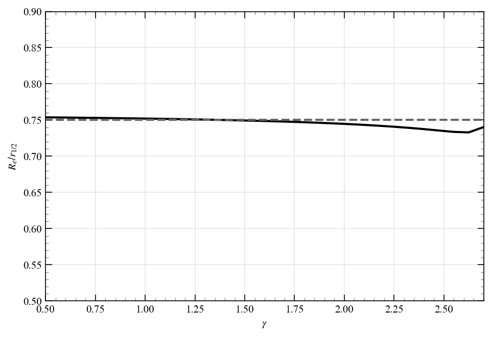

<!-- ======================= -->
<!-- PROBLEM 2.11             -->
<!-- ======================= -->
## Problem 2.11

Consider a potential of the form

$$
\Phi(r) = -\frac{GM_p}{a}\frac{1}{(1 + r^p/a^p)^{1/p}}
$$


### Density
The density can be directly calculated from Poisson's equation.

$$
\begin{align}
\rho(r) &= \frac{1}{4\pi G}\nabla^2\Phi(r) \\
&= \frac{1}{4\pi G}\frac{1}{r^2}\frac{d}{dr}\left(r^2\frac{d\Phi}{dr}\right) \\
&= \frac{M_p}{4\pi}\frac{1}{r^2}\frac{d}{dr}\left(\frac{r^2 (r/a)^{p-1}}{a^2(1 + (r/a)^p)^{1 + 1/p}}\right) \\
&= \frac{M_p(p+1)}{4\pi a^3}\frac{(r/a)^{p-2}}{(1 + (r/a)^p)^{2 + 1/p}} \\
\end{align}
$$

### Mass

The mass can also be directly calculated from the potential

$$
\begin{align}
M(r) &= \frac{1}{G}r^2\frac{d\Phi}{dr} \\
&= \frac{M_p r^2 (r/a)^{p-1}}{a^2(1 + (r/a)^p)^{1 + 1/p}} \\
&= M_p\frac{(r/a)^{p+1}}{(1 + (r/a)^p)^{1 + 1/p}} \\
\end{align}
$$

Total mass is $M_p$ as $r\to\infty$, so the $r_{1/2}$ can be found by solving

$$
M(r_{1/2}) = \frac{M_p}{2} = M_p\frac{(r_{1/2}/a)^{p+1}}{(1 + (r_{1/2}/a)^p)^{1 + 1/p}}
$$

Define $x = (r_{1/2}/a)^p$, so that the equation becomes

$$
\frac{1}{2} = \frac{x^{(p+1)/p}}{(1 + x)^{1 + 1/p}} = \left(\frac{x}{1 + x}\right)^{(p+1)/p}
$$

Threfore

$$
r_{1/2} = a\left(2^{p/(p+1)} - 1\right)^{-1/p}
$$

<!-- ======================= -->
<!-- PROBLEM 2.12             -->
<!-- ======================= -->
## Problem 2.12

Instead of calculating the projected mass using $\Sigma(R) = 2\int_0^\infty dz\, \rho(\sqrt{R^2 + z^2})$ I will use the Abel form

$$
\Sigma(R) = 2\int_R^\infty dr\,\frac{r\rho(r)}{\sqrt{r^2 - R^2}},
$$

with

$$
\rho(r) = \frac{(3 - \gamma)M}{4\pi a^3} \frac{1}{y^\gamma(1 + y)^{4 - \gamma}},
$$

Defining $x = R/a$ and $y = r/a$, this becomes

$$
\Sigma(R) = \frac{M}{a^2}s(x), \quad s(x) = \frac{(3 - \gamma)}{2\pi}\int_x^\infty dy\,\frac{y^{1 - \gamma}}{(1 + y)^{4 - \gamma}\sqrt{y^2 - x^2}}. \tag{2.12.1}
$$

and the projected mass

$$
M_{\mathrm{proj}}(<R) = M m_p(x), \quad m_p(x) = 2\pi\int_0^x dx'\, x' s(x'). \tag{2.12.2}
$$

The effective radius requires to find $x_e$ such that $m_p(x_e) = 1/2$. Also, the half-mass radius in 3D is given by $y_{1/2} = (2^{1/(3 - \gamma)} - 1)^{-1}$.

Before I go into the details of the numerical implementation, I will plot the effective radius as a function of $\gamma$.

```python
from galactic_dynamics_bovy.chapter02.effective_radius_gamma import plot_effective_radius_gamma
plot_effective_radius_gamma()
```



*Figure 2.12: Effective radius as a function of $\gamma$. For large $\gamma$ the mass becomes more centrally concentrated, which makes numerically convergence a bit more challenging. Line $R_e/r_{1/2} = 3/4$ added for reference.*

Now, the numerical considerations

1. I pre-compute $s(x)$ on a grid in $x$ for a given $\gamma$ using `scipy.integrate.quad` to evaluate the integral in equation (2.12.1). Same as $m_p(x)$.
2. The values are interpolated using `scipy.interpolate.interp1d`. If a value outside the grid is requested, I directly use equations (2.12.1) and (2.12.2) to compute the values.
3. Instead of optimizing for $x_e$ such that $m_p(x_e) = 1/2$, I just evalute the interpolation $x = x(m_p)$
4. All these interpolations and numerical integrations deal with numerical divergences at small $x$, unfortunately large values of $\gamma$ make this more challenging, as the density becomes more centrally concentrated. I use logarithmic grids and careful handling of small values to mitigate this, however numerical noise remains for large $\gamma$.

<!-- ======================= -->
<!-- PROBLEM 2.13             -->
<!-- ======================= -->
## Problem 2.13


### Density profile
Define

$$
p = K\rho^2 \quad K = \frac{2\pi \hbar^2a}{m^3}.
$$

In hydrostatic equilibrium

$$
\frac{dp}{dr} = 2K\rho\frac{d\rho}{dr} = -\frac{GM(r)\rho(r)}{r^2} = -\rho \frac{d\Phi}{dr}.
$$

From here

$$
\Phi(r) = -2K\rho(r) + \text{constant}.
$$

Now, applying Poisson's equation

$$
\nabla^2\Phi = -2K\nabla^2\rho = 4\pi G \rho, \quad \nabla^2\rho +k^2 \rho = 0, \quad k^2 = \frac{2\pi G}{K}.
$$

(Density profile is a solution to the Helmholtz equation!)
The general solution is

$$
\rho(r) = \frac{A\sin(kr)}{r} + \frac{B\cos(kr)}{r}.
$$

To ensure regular solutions at $r=0$, we set $B=0$. Setting $\rho_0 = \lim_{r\to 0}\rho(r) = Ak$, we have

$$
\rho(r) = \rho_0 \mathrm{sinc}(kr), \quad k = \sqrt{\frac{Gm^3}{\hbar^2 a}}.
$$

### Boundary radius
The boundary radius $R$ is defined as the radius where $\rho(R) = 0$,

$$
\sin(kR) = 0 \implies R = \frac{\pi}{k} = \pi\sqrt{\frac{\hbar^2 a}{G m^3}}.
$$

### Circular velocity

The circular velocity is given by

$$
v_c^2 = \frac{GM(<r)}{r} = \frac{4\pi G\rho_c}{k^2}\left(\frac{\sin(kr)}{kr} - \cos(kr)\right), \quad r \le \pi/k.
$$


*Figure 2.13: Circular velocity profile of the Fermi gas model with $R=15\, \mathrm{kpc}$ and $M=10^{11}\, \mathrm{M}_\odot$.*


Script to generate figure:

```python
from galactic_dynamics_bovy.chapter02.fermi_gas_vcirc import plot_fermi_gas_vcirc
plot_fermi_gas_vcirc()
```

Note that for $r > R$ the circular velocity is simply $v_c^2 = GM/r$.
