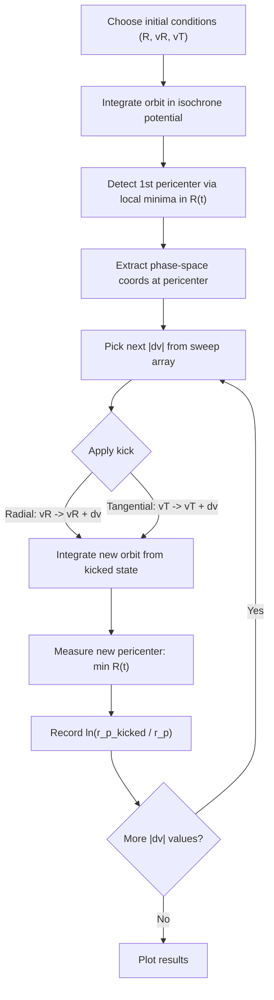
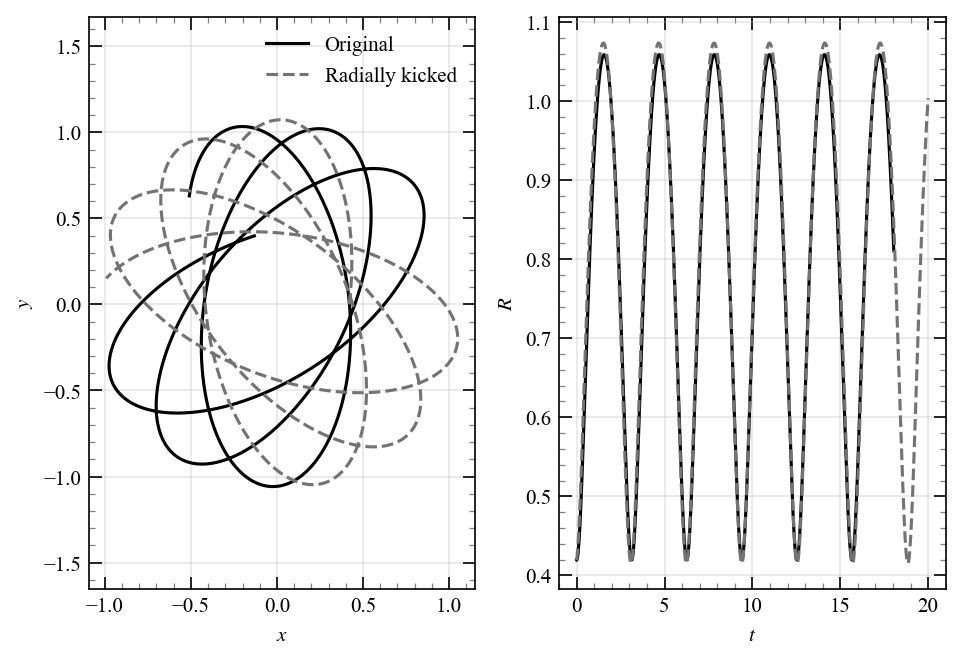
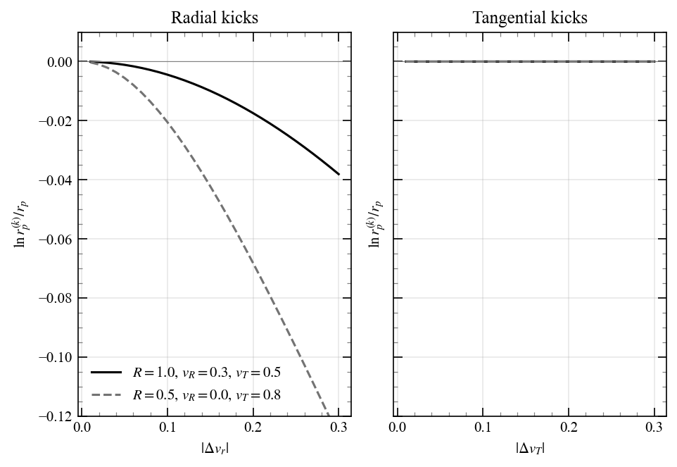
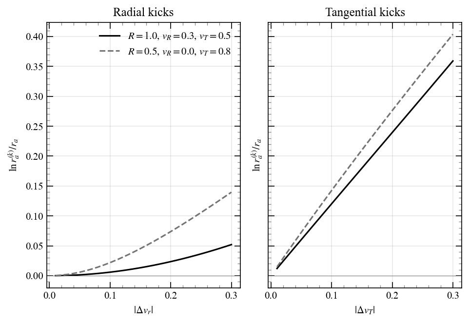
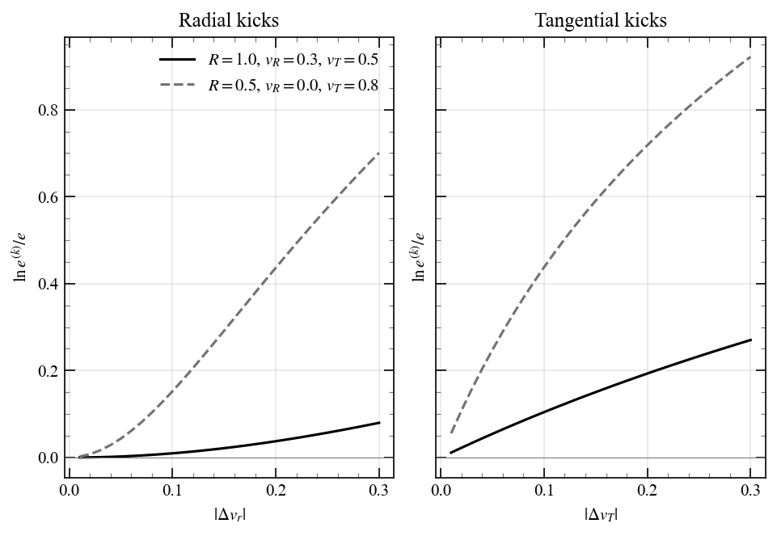

# Chapter 4: Orbits in spherical mass distributions

<!-- ======================= -->
<!-- PROBLEM 4.1             -->
<!-- ======================= -->
## Problem 4.1

In a homogeneous spherical potential, the radial frequency is constant, independent of energy and angular momentum, $T_r = \pi/\omega$.

<!-- ======================= -->
<!-- PROBLEM 4.2             -->
<!-- ======================= -->
## Problem 4.2

### Qualitative argument

There are two limiting cases for the ratio of the radial period $T_r$ to the azimuthal period $T_\psi$:

| Potential | Rotation curve | $T_r / T_\psi$ |
|---|---|---|
| Homogeneous sphere | $v_c \propto r$ | $1/2$ |
| Kepler | $v_c \propto r^{-1/2}$ | $1$ |

with the isochrone interpolating between them: $1/2 \leq T_r/T_\psi \leq 1$.

The Milky Way has a roughly flat rotation curve near the Sun ($v_c \approx \mathrm{const}$), which lies between the rising rotation curve of the homogeneous sphere and the falling Keplerian one. Therefore $T_r/T_\psi$ should be somewhere between $1/2$ and $1$, giving

$$
T_r \sim 110\text{-}220\,\mathrm{Myr}.
$$

### More refined argument

For a power-law rotation curve $v_c \propto r^\beta$, the circular frequency is $\Omega = v_c/r \propto r^{\beta - 1}$, so $\Omega^2 \propto r^{2(\beta-1)}$. The epicyclic frequency is

$$
\kappa^2 = R\frac{d\Omega^2}{dR} + 4\Omega^2 = 2(\beta - 1)\Omega^2 + 4\Omega^2 = 2(\beta + 1)\,\Omega^2,
$$

giving

$$
\frac{T_r}{T_\psi} = \frac{\Omega}{\kappa} = \frac{1}{\sqrt{2(\beta + 1)}}.
$$

This reproduces the two limits: $\beta = 1 \to T_r/T_\psi = 1/2$ and $\beta = -1/2 \to T_r/T_\psi = 1$.

For a flat rotation curve ($\beta = 0$):

$$
\frac{T_r}{T_\psi} = \frac{1}{\sqrt{2}},
$$

and with $T_\psi \approx 220\,\mathrm{Myr}$:

$$
T_r = \frac{220\,\mathrm{Myr}}{\sqrt{2}} \approx 155\,\mathrm{Myr}.
$$

<!-- ======================= -->
<!-- PROBLEM 4.3             -->
<!-- ======================= -->
## Problem 4.3

### Part a

With

$$
s = 1 + \sqrt{1 + \frac{r^2}{b^2}},
$$

the isochrone potential can be written as

$$
\begin{align}
\Phi(r) &= -\frac{GM}{b + \sqrt{b^2 + r^2}} \\
&= -\frac{GM}{b \left(1 + \sqrt{1 + r^2/b^2}\right)} \\
&= -\frac{GM}{b s}.
\end{align}
$$

We can invert $r$ to get

$$
r^2 = b^2(s^2 - 2s) = b^2 s(s-2) = f(s).
$$

### Part b

Becasue we are going to need it later, call

$$
g(r) = 2[E - \Phi(r)] - \frac{L^2}{r^2} = 2E +2\frac{GM}{b s} - \frac{L^2}{b^2 s(s-2)},
$$

So that

$$
s(s - 2) g(r) = 2Es^2 - 2\left(2E - \frac{GM}{b}\right)s - \left(\frac{4GM}{b} + \frac{L^2}{b^2}\right). \tag{4.3.1}
$$

The turning points are solutions to the equation $g(r) = 0$,

$$
2Es^2 - 2\left(2E - \frac{GM}{b}\right)s - \left(\frac{4GM}{b} + \frac{L^2}{b^2}\right) = 0,
$$

whose solutions are

$$
4Es_{1,2} = 2\left(2E - \frac{GM}{b}\right) \pm \sqrt{4\left(2E - \frac{GM}{b}\right)^2 + 8E\left(\frac{4GM}{b} + \frac{L^2}{b^2}\right)}.
$$

Therefore

$$
s(s - 2) g(r) = 2E(s - s_1)(s - s_2) = -2E(s_2 - s)(s - s_1).
$$

### Part c

$$
\begin{align}
T_r &= 2\int_{r_p}^{r_a} dr\, \frac{1}{\sqrt{g(r)}} \\
&= 2\int_{s_1}^{s_2} ds\,\frac{dr}{ds} \frac{1}{\sqrt{g(r)}} \\
&= 2\int_{s_1}^{s_2} ds\, \frac{b(s - 1)}{\sqrt{s(s-2)g(r)}} \\
&= \frac{2b}{\sqrt{-2E}} \int_{s_1}^{s_2} ds\, \frac{s - 1}{\sqrt{(s_2 - s)(s - s_1)}} \\
&= \frac{2b}{\sqrt{-2E}} \frac{\pi}{2}(s_1 + s_2 - 2) \\
&\stackrel{(4.3.1)}{=} \frac{\pi b}{\sqrt{-2E}}\left[\frac{4}{4E}\left(2E - \frac{GM}{b} \right) - 2\right] \\
&= -\frac{\pi b}{\sqrt{-2E}}\frac{GM}{bE} \\
&= \frac{2\pi GM}{(-2E)^{3/2}}.
\end{align}
$$

### Part d

$$
\begin{align}
\Delta\psi &= 2\int_{r_p}^{r_a} \frac{L}{r^2} \frac{dr}{\sqrt{g(r)}} \\
&= 2\int_{s_1}^{s_2} ds\, \frac{L}{b^2 s(s-2)} \cdot \frac{b(s-1)}{\sqrt{s(s-2)}} \cdot \frac{\sqrt{s(s-2)}}{\sqrt{-2E}\sqrt{(s_2-s)(s-s_1)}} \\
&= \frac{2L}{b\sqrt{-2E}} \int_{s_1}^{s_2} ds\, \frac{s - 1}{s(s-2)\sqrt{(s_2 - s)(s - s_1)}} \\
&= \Delta\psi = \frac{\pi L}{b\sqrt{-2E}}\left(\frac{1}{\sqrt{s_1 s_2}} + \frac{1}{\sqrt{(s_1-2)(s_2-2)}}\right).
\end{align}
$$

From Vieta's formulas applied to the quadratic (4.3.1),

$$
s_1 s_2 = -\frac{1}{2E}\left(\frac{4GM}{b} + \frac{L^2}{b^2}\right) = \frac{4GMb + L^2}{2b^2(-E)},
$$

and

$$
(s_1-2)(s_2-2) = s_1 s_2 - 2(s_1 + s_2) + 4 = \frac{L^2}{2b^2(-E)},
$$

where in the last step we used $s_1 + s_2 = 2 - GM/(bE)$. Therefore

$$
\frac{1}{\sqrt{s_1 s_2}} = \frac{b\sqrt{-2E}}{\sqrt{L^2 + 4GMb}}, \qquad \frac{1}{\sqrt{(s_1-2)(s_2-2)}} = \frac{b\sqrt{-2E}}{|L|}.
$$

Substituting back,

$$
\Delta\psi = \frac{\pi L}{b\sqrt{-2E}}\left(\frac{b\sqrt{-2E}}{\sqrt{L^2 + 4GMb}} + \frac{b\sqrt{-2E}}{|L|}\right) = \pi\,\mathrm{sign}(L)\left(1 + \frac{|L|}{\sqrt{L^2 + 4GMb}}\right).
$$

<!-- ======================= -->
<!-- PROBLEM 4.4             -->
<!-- ======================= -->
## Problem 4.4

The latitudinal action is

$$
J_\theta = \frac{1}{2\pi}\oint d\theta\, p_\theta
$$

From [Problem 3.3](chapter03.1.md#problem-33), the conjugate momenta per unit mass are $p_r = \dot{r}$, $p_\theta = r^2\dot{\theta}$, and $p_\phi = r^2\sin^2\theta\,\dot{\phi} = L_z$. Since only the tangential components of $\mathbf{v}$ contribute to $\mathbf{L} = \mathbf{r}\times\mathbf{v}$:

$$
L^2 = r^4\dot{\theta}^2 + r^4\sin^2\theta\,\dot{\phi}^2 = p_\theta^2 + \frac{L_z^2}{\sin^2\theta},
$$

so the conjugate momentum is

$$
p_\theta = \sqrt{L^2 - \frac{L_z^2}{\sin^2\theta}}.
$$

The orbit in $\theta$ oscillates between turning points $\theta_{\min}$ and $\theta_{\max} = \pi - \theta_{\min}$, where $p_\theta = 0$ gives $\sin\theta_{\min} = |L_z|/L$. Therefore

$$
J_\theta = \frac{1}{\pi}\int_{\theta_{\min}}^{\pi - \theta_{\min}} d\theta\,\sqrt{L^2 - \frac{L_z^2}{\sin^2\theta}}.
$$

Substituting $u = \cos\theta$ (so $du = -\sin\theta\,d\theta$) with $u_0 = \cos\theta_{\min} = \sqrt{1 - L_z^2/L^2}$:

$$
J_\theta = \frac{L}{\pi}\int_{-u_0}^{u_0} du\,\frac{\sqrt{u_0^2 - u^2}}{1 - u^2},
$$

where I used $L^2 - L^2 u^2 - L_z^2 = L^2(u_0^2 - u^2)$.

Now substitute $u = u_0\sin t$ (so $du = u_0\cos t\,dt$):

$$
J_\theta = \frac{2Lu_0^2}{\pi}\int_0^{\pi/2} dt\,\frac{\cos^2 t}{1 - u_0^2\sin^2 t}.
$$

Writing $\cos^2 t = 1 - \sin^2 t$ and using

$$
\frac{\sin^2 t}{1 - u_0^2\sin^2 t} = \frac{1}{u_0^2}\left(\frac{1}{1 - u_0^2\sin^2 t} - 1\right),
$$

the integrand simplifies to

$$
\frac{\cos^2 t}{1 - u_0^2\sin^2 t} = \frac{u_0^2 - 1}{u_0^2}\cdot\frac{1}{1 - u_0^2\sin^2 t} + \frac{1}{u_0^2}.
$$

Using the standard result $\displaystyle\int_0^{\pi/2}\frac{dt}{1 - a^2\sin^2 t} = \frac{\pi}{2\sqrt{1-a^2}}$ for $a^2 < 1$, and noting $\sqrt{1 - u_0^2} = |L_z|/L$:

$$
\int_0^{\pi/2}\frac{dt}{1 - u_0^2\sin^2 t} = \frac{\pi}{2|L_z|/L} = \frac{\pi L}{2|L_z|}.
$$

Putting it all together:

$$
\begin{align}
J_\theta &= \frac{2L}{\pi}\left[\left(u_0^2 - 1\right)\cdot\frac{\pi L}{2|L_z|} + \frac{\pi}{2}\right] \\
&= \frac{2L}{\pi}\left[-\frac{L_z^2}{L^2}\cdot\frac{\pi L}{2|L_z|} + \frac{\pi}{2}\right] \\
&= \frac{2L}{\pi}\cdot\frac{\pi}{2}\left[1 - \frac{|L_z|}{L}\right] \\
&= L - |L_z|.
\end{align}
$$

<!-- ======================= -->
<!-- PROBLEM 4.10            -->
<!-- ======================= -->
## Problem 4.10 🌶️

Consider an orbit in an isochrone potential,

$$
\Phi(r) = -\frac{GM}{b + \sqrt{b^2 + r^2}},
$$

and suppose we apply an instantaneous velocity kick $\Delta \mathbf{v}$ at pericenter. We want to understand how the new pericenter compares to the original, and whether radial and tangential kicks differ in their effect.

### Part a: Orbit integration and pericenter measurement

The orbit comparison below shows the original orbit (solid) versus a radially kicked orbit (dashed), both starting from the same pericenter:

The plot below shows $\ln(r_p^{(k)} / r_p)$ versus kick magnitude, where $r_p$ is the original pericenter and $r_p^{(k)}$ is the pericenter after the kick:

- **Radial kicks** (left): the log-ratio is negative — the pericenter **decreases**. The orbit becomes more eccentric.
- **Tangential kicks** (right): the log-ratio is zero (within numerical noise).

### Part b: Pure tangential kick

From the equation

$$
\frac{1}{2}v_r^2 + \Phi_{\mathrm{eff}}(r) = E \quad \text{where} \quad \Phi_{\mathrm{eff}}(r;L_z) = \Phi(r) + \frac{L_z^2}{2r^2},
$$

we have that at the pericenter

$$
E = \Phi_{\mathrm{eff}}(r_p) = \Phi(r_p) + \frac{L_z^2}{2r_p^2}. \tag{4.10.1}
$$

Take $\Delta v_R = 0$ and $\Delta v_T > 0$, then immediately after the kick

$$
\begin{align}
L^{(k)} &= r_p (v_T + \Delta v_T) = L_z + r_p \Delta v_T, \\
E^{(k)} &= \frac{1}{2}(v_R^2 + (v_T + \Delta v_T)^2) + \Phi(r_p) = E + v_T \Delta v_T + \frac{1}{2}(\Delta v_T)^2. \tag{4.10.2}
\end{align}
$$

and the effective potential after the kick is

$$
\begin{align}
\Phi_{\mathrm{eff}}(r_p;L^{(k)}) &= \Phi(r_p) + \frac{(L^{(k)})^2}{2r_p^2} \\
&= \Phi(r_p) + \frac{L_z^2}{2r_p^2} + \frac{L_z}{r_p}\Delta v_T + \frac{(\Delta v_T)^2}{2} \\
&\stackrel{(4.10.1)}{=} E + v_T\Delta v_T + \frac{(\Delta v_T)^2}{2} \\
&\stackrel{(4.10.2)}{=} E^{(k)}.
\end{align}
$$

which means $r_p$ is still a turning point of the new orbit, so the pericenter does not change.

### Part b: Pure radial kick
Now take $\Delta v_T = 0$ and $\Delta v_R > 0$, then immediately after the kick

$$
\begin{align}
L^{(k)} &= r_p v_T = L_z, \tag{4.10.3} \\
E^{(k)} &= \frac{1}{2}((0 + \Delta v_R)^2 + v_T^2) + \Phi(r_p) = \Phi(r_p) + \frac{1}{2}v_T^2 + \frac{1}{2}(\Delta v_R)^2.
\end{align}
$$

Which means that

$$
\begin{align}
E^{(k)} - \Phi_{\mathrm{eff}}(r_p;L_z^{(k)}) &\stackrel{(4.10.3)}{=} E^{(k)} - \Phi_{\mathrm{eff}}(r_p;L_z) \\
&= \left[ \Phi(r_p) + \frac{1}{2}v_T^2 + \frac{1}{2}(\Delta v_R)^2 \right] - \left[ \Phi(r_p) + \frac{L_z^2}{2r_p^2} \right] \\
&= \frac{1}{2}(\Delta v_R)^2 > 0,
\end{align}
$$

So $r_p$ is no longer a turning point of the new orbit, the new pericenter is the new root of the equation $E^{(k)} = \Phi_{\mathrm{eff}}(r;L_z)$. To see in which direction the pericenter changes, note that $\Phi_{\mathrm{eff}}(r;L_z)$ is a decreasing function of $r$ for $r < r_p$ and an increasing function of $r$ for $r > r_p$. Since $E^{(k)} > \Phi_{\mathrm{eff}}(r_p;L_z)$, the new pericenter must be smaller than the original one, $r_p^{(k)} < r_p$, exactly as we found in the numerical experiment.

### Part c: Apocenter and eccentricity

The same analysis can be extended to the apocenter radius and the orbital eccentricity $e = (r_a - r_p)/(r_a + r_p)$:

- **Radial kicks** increase both the apocenter and the eccentricity — the orbit becomes larger and more elongated.
- **Tangential kicks** increase the apocenter but leave the eccentricity nearly unchanged, consistent with the pericenter being preserved.

!!! warning "Not sure where to start"
    I am not sure how to start this problem, I will come back to this later.
