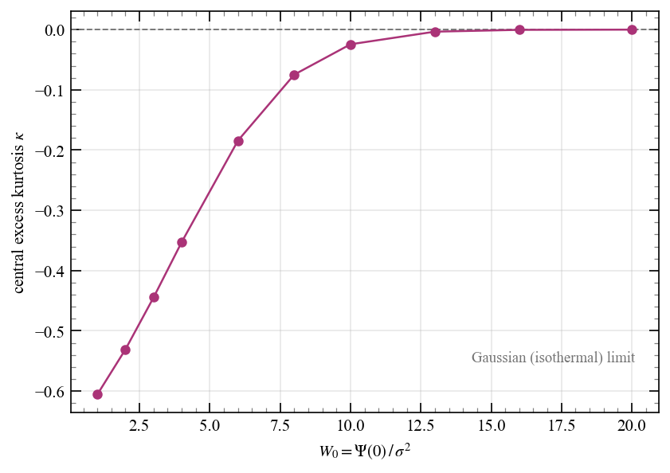

# Chapter 5: Equilibria of collisionless stellar systems

<!-- ======================= -->
<!-- PROBLEM 5.1             -->
<!-- ======================= -->
## Problem 5.1

Assuming each star is roughly $1\,M_\odot$, Fornax has $N = 10^7$ stars. The relaxation time is approximately

$$
\begin{align}
t_{\mathrm{relax}} &\approx \frac{N}{8\ln N}\,t_{\mathrm{cross}} \\
&= \frac{N}{8\ln N}\,\frac{2\pi R}{\sigma} \\
&\approx \frac{10^7}{8 \times 16.1} \times \frac{2\pi \times 1\,\mathrm{kpc}}{10\,\mathrm{km/s}} \\
&\approx 4.7 \times 10^4\,\mathrm{Gyr}
\end{align}
$$

<!-- ======================= -->
<!-- PROBLEM 5.2             -->
<!-- ======================= -->
## Problem 5.2

From the virial theorem $2K + W = 0$, if the mass increases by a factor of $f$ and all the distances remain the same, then $W$ increases by a factor of $f^2$ (since $W \propto M^2/R$) and thus $K$ must also increase by a factor of $f^2$. Since $K \propto M \sigma^2$, $\sigma$ must increase by a factor of $\sqrt{f}$.

<!-- ======================= -->
<!-- PROBLEM 5.3             -->
<!-- ======================= -->
## Problem 5.3

### Acceleration is dominated by distant bodies

The gravitational force from a single body at distance $r$ is $Gm/r^2$. In a roughly homogeneous system the enclosed mass grows as $M(<r) \propto r^3$, so the cumulative acceleration from all mass inside radius $r$ is

$$
a(<r) \sim \frac{GM(<r)}{r^2} \propto r
$$

which increases with $r$: distant matter dominates. More concretely, the nearest neighbor sits at $d \sim R/N^{1/3}$ and contributes $a_{\mathrm{near}} \sim Gm/d^2$, while the total smooth-field acceleration is $a_{\mathrm{smooth}} \sim GNm/R^2$. Their ratio is

$$
\frac{a_{\mathrm{near}}}{a_{\mathrm{smooth}}} \sim \frac{1}{N}\left(\frac{R}{d}\right)^2 \sim N^{-1/3} \ll 1
$$

so the nearest neighbor's contribution is negligible.

### Jerk is dominated by nearby bodies

The jerk from a body at distance $r$ involves the tidal tensor $\partial^2\Phi/\partial x_i\partial x_j \sim Gm/r^3$, giving a jerk that scales as $Gmv/r^3$. The contribution from particles in a shell of radius $r$ and thickness $dr$ to the total stochastic jerk magnitude is

$$
d\dot{a}(r) \sim n\,r^2 dr \cdot \frac{Gmv}{r^3} = Gnmv \frac{dr}{r}
$$

which implies $\dot{a}$ logarithmically diverges as $r \to 0$: nearby bodies dominate. The nearest neighbor at distance $d \sim R/N^{1/3}$ contributes

$$
\dot{a}_{\mathrm{near}} \sim \frac{Gmv}{d^3} \sim Gnmv \sim G\bar{\rho}\,v
$$

which is of the same order as the jerk from the entire smooth-field tidal tensor ($\dot{a}_{\mathrm{smooth}} \sim G\bar{\rho}\,v$). Unlike the acceleration, where the nearest neighbor is suppressed by $N^{-1/3}$, the nearest neighbor contributes an amount of order $G \bar{\rho} v$, which is comparable to the smooth-field jerk. This implies that the jerk remains stochastic and "grainy" even as $N \to \infty$ (at fixed total mass and density), whereas the acceleration becomes perfectly smooth in that limit because $a_{\mathrm{near}}/a_{\mathrm{smooth}} \to 0$.

<!-- ======================= -->
<!-- PROBLEM 5.4             -->
<!-- ======================= -->
## Problem 5.4

### Part a

The mean-squared velocity change per crossing comes from two-body encounters with both stars and dark-matter particles. For a species with individual mass $m_i$ and total number $N_i$:

$$
\langle \Delta v^2 \rangle_i = 8 N_i \left(\frac{G m_i}{R v}\right)^2 \ln \Lambda_i
$$

Writing $N_i = M_i / m_i$ where $M_i$ is the total mass of species $i$:

$$
\langle \Delta v^2 \rangle_i \propto M_i\, m_i
$$

The ratio of dark-matter to stellar contributions is therefore

$$
\frac{\langle \Delta v^2 \rangle_{\mathrm{DM}}}{\langle \Delta v^2 \rangle_*} = \frac{M_{\mathrm{DM}}\, m_{\mathrm{DM}}}{M_*\, m} = \frac{f}{1-f}\,\frac{m_{\mathrm{DM}}}{m} \tag{5.4.1}
$$

The mass-fraction ratio $f/(1-f)$ is of order unity (e.g. $\approx 1$ for $f = 0.5$), but $m_{\mathrm{DM}}/m \ll 1$ so the product is negligible. That is, if dark matter is made of particles, then its discreteness negligibly contributes to two-body relaxation compared to the stars.

With total galaxy mass $M$, dark-matter fraction $f$, stellar mass $M_* = (1-f)M$, and $N_* = (1-f)M/m$ stars, the dominant contribution is

$$
\langle \Delta v^2 \rangle \approx 8 N_* \left(\frac{Gm}{Rv}\right)^2 \ln \Lambda
$$

The velocity dispersion is still set by the total mass via the virial theorem, $v^2 \sim GM/R$, so the relaxation time is

$$
t_{\mathrm{relax}} = \frac{v^2}{\langle \Delta v^2 \rangle / t_{\mathrm{cross}}} = \frac{M}{8(1-f)\,m\,\ln\Lambda}\,t_{\mathrm{cross}}
$$

With the Coulomb logarithm $\Lambda \approx R v^2/(Gm) = M/m$, this becomes

$$
t_{\mathrm{relax}} = \frac{1}{1-f}\,\frac{M/m}{8\ln(M/m)}\,t_{\mathrm{cross}}
$$

Compared to a galaxy of the same total mass with no dark matter, the relaxation time is longer by a factor of $1/(1-f)$. Dark matter contributes to the smooth gravitational potential (setting $v$) but, because $m_{\mathrm{DM}} \ll m$, it does not contribute to the graininess that drives two-body relaxation. Fewer stars for the same total mass means a smoother system and slower relaxation.

### Part b

From Eq. (5.4.1), dark-matter encounters become important when the ratio is of order unity:

$$
\frac{f}{1-f}\,\frac{m_{\mathrm{DM}}}{m} \sim 1
\quad \Longrightarrow \quad
m_{\mathrm{DM}} \sim \frac{1-f}{f}\,m
$$

For $f \approx 0.5$ this gives $m_{\mathrm{DM}} \sim m \sim M_\odot$. This is precisely the regime of MACHOs [massive compact halo objects; @griest1991] or primordial black holes of stellar mass. For any $m_{\mathrm{DM}} \gtrsim \frac{1-f}{f}\,m$, the dark-matter particles contribute significantly to two-body relaxation and must be included in the calculation.

### Part c

With $m_{\mathrm{DM}} = 100\,M_\odot$ and $f = 0.5$, Eq. (5.4.1) gives a ratio of $100$: dark-matter encounters now dominate relaxation. Including both species, the general relaxation time is

$$
\begin{align}
t_{\mathrm{relax}} &= \frac{M^2}{8\bigl[(1-f)\,M\,m\,\ln\Lambda_* + f\,M\,m_{\mathrm{DM}}\,\ln\Lambda_{\mathrm{DM}}\bigr]}\,t_{\mathrm{cross}} \\
&= \frac{M}{8\bigl[(1-f)\,m\,\ln\Lambda_* + f\,m_{\mathrm{DM}}\,\ln\Lambda_{\mathrm{DM}}\bigr]}\,t_{\mathrm{cross}}
\end{align}
$$

where $\Lambda_i \approx M/m_i$. For the Milky Way within the visible region we adopt $M \approx 10^{11}\,M_\odot$, $R \approx 10\,\mathrm{kpc}$, $v \approx 220\,\mathrm{km/s}$, with $m = 1\,M_\odot$:

$$
\Lambda_* = M/m = 10^{11} \;\Rightarrow\; \ln\Lambda_* \approx 25.3
\qquad
\Lambda_{\mathrm{DM}} = M/m_{\mathrm{DM}} = 10^{9} \;\Rightarrow\; \ln\Lambda_{\mathrm{DM}} \approx 20.7
$$

The crossing time is

$$
t_{\mathrm{cross}} = \frac{2\pi R}{v} = \frac{2\pi \times 10\,\mathrm{kpc}}{220\,\mathrm{km/s}} \approx 0.28\,\mathrm{Gyr}
$$

And

$$
(1-f)\,m\,\ln\Lambda_* + f\,m_{\mathrm{DM}}\,\ln\Lambda_{\mathrm{DM}} \approx 1048\,M_\odot
$$

confirming that the primordial black holes contribute $\sim\!99\%$ of the relaxation. Thus

$$
t_{\mathrm{relax}}
\approx \frac{10^{11}}{8 \times 1048} \times 0.28\,\mathrm{Gyr}
\approx 3.3 \times 10^{6}\,\mathrm{Gyr}
$$

For comparison, a pure-stellar Milky Way ($f = 0$, $N = 10^{11}$) would have $t_{\mathrm{relax}} \approx 1.4 \times 10^{8}\,\mathrm{Gyr}$, about 40 times longer. Even so, $3.3 \times 10^{6}\,\mathrm{Gyr} \gg t_{\mathrm{Hubble}} \approx 14\,\mathrm{Gyr}$, so the Milky Way remains safely collisionless even in this extreme scenario.

### Part d

The dark-matter mass enclosed within the cluster's half-light radius is

$$
M_{\mathrm{DM}} = \rho_{\mathrm{DM}}\,\frac{4}{3}\pi\,r_h^3
= 0.3\,\frac{M_\odot}{\mathrm{pc}^3} \times \frac{4}{3}\pi\,(13\,\mathrm{pc})^3
\approx 2{,}760\,M_\odot
$$

giving $N_{\mathrm{DM}} = M_{\mathrm{DM}}/m_{\mathrm{DM}} \approx 28$ primordial black holes inside the cluster, alongside $N_* = 5{,}000$ stars. The Coulomb logarithms for each species are

$$
\Lambda_i = \frac{r_h\,\sigma^2}{G\,m_i}
\quad\Rightarrow\quad
\ln\Lambda_* \approx 11.2,\quad \ln\Lambda_{\mathrm{DM}} \approx 6.6
$$

The contributions to $\langle \Delta v^2 \rangle$ per crossing are proportional to $N_i\,m_i^2\,\ln\Lambda_i$:

$$
N_*\,m^2\,\ln\Lambda_* = 5{,}000 \times 1 \times 11.2 = 5.6 \times 10^4\,M_\odot^2
$$

$$
N_{\mathrm{DM}}\,m_{\mathrm{DM}}^2\,\ln\Lambda_{\mathrm{DM}} = 28 \times 10^4 \times 6.6 = 1.85 \times 10^6\,M_\odot^2
$$

so the 28 primordial black holes contribute $\sim\!97\%$ of the relaxation despite being vastly outnumbered. The number of crossings to relax is

$$
n_{\mathrm{cross}}
= \frac{\sigma^4\,r_h^2}{8\,G^2\,\sum_i N_i\,m_i^2\,\ln\Lambda_i}
\approx 375
$$

With $t_{\mathrm{cross}} = 2\pi\,r_h/\sigma \approx 16\,\mathrm{Myr}$:

$$
t_{\mathrm{relax}} \approx 375 \times 16\,\mathrm{Myr} \approx 6\,\mathrm{Gyr}
$$

This is less than the age of the universe, so $100\,M_\odot$ primordial black holes could plausibly destroy the Eridanus II star cluster through two-body encounters. For comparison, without dark matter the cluster would have $t_{\mathrm{relax}} \approx 200\,\mathrm{Gyr}$, safely collisionless.

<!-- ======================= -->
<!-- PROBLEM 5.5             -->
<!-- ======================= -->
## Problem 5.5

### Part a

In a razor-thin disk of radius $R$ with $N$ stars, the surface number density is $\Sigma_n = N/(\pi R^2)$. A star traversing the disk sweeps a strip of length $\sim 2R$ and width $2\,db$ (both sides) at impact parameter $b$:

$$
dN_{\mathrm{enc}} = \Sigma_n \times 2\,db \times 2R = \frac{4N}{\pi R}\,db.
$$

This is the key contrast with 3D, where the annular geometry gives $dN_{\mathrm{enc}} \propto b\,db$. The mean-squared velocity change per crossing is

$$
\begin{align}
\langle \Delta v^2 \rangle &= \int_{b_{\min}}^{R} dN_{\mathrm{enc}}\, (\delta v)^2 \\
&= \frac{16\,G^2 m^2 N}{\pi R\,v^2} \int_{b_{\min}}^{R} \frac{db}{b^2} \\
&= \frac{16\,G^2 m^2 N}{\pi R\,v^2} \left(\frac{1}{b_{\min}} - \frac{1}{R}\right) \\
&\approx \frac{16\,G^2 m^2 N}{\pi R\,v^2} \times \frac{1}{b_{\min}} \\
&= \frac{16\,G^2 m^2 N}{\pi R\,v^2} \times \frac{v^2}{2Gm} \\
&= \frac{8\,GmN}{\pi R}
\end{align}
$$

The number of crossings to relax is

$$
n_{\mathrm{cross}} = \frac{v^2}{\langle \Delta v^2 \rangle} = \frac{\pi\,R\,v^2}{8\,GmN}
$$

Applying the virial theorem $v^2 \sim GNm/R$:

$$
\frac{t_{\mathrm{relax}}}{t_{\mathrm{dyn}}} \sim \frac{\pi}{8} \sim \mathcal{O}(1)
$$

### Part b

The difference is purely geometric, in how encounters at impact parameter $b$ are counted:

- **3D (sphere):** encounters live in a cylindrical shell of area $2\pi b\,db$, so $dN_{\mathrm{enc}} \propto b\,db$. The factor of $b$ partially cancels the $1/b^2$ from $(\delta v)^2$, giving $\int db/b = \ln\Lambda$, all scales contribute roughly equally (logarithmically). Distant encounters collectively matter as much as close ones, and relaxation requires $\sim N/\ln N$ crossings.

- **2D (disk):** encounters live in a strip of width $2\,db$ with no extra factor of $b$, so $dN_{\mathrm{enc}} \propto db$. The integral becomes $\int db/b^2$, completely dominated by the closest encounters. Close encounters are so efficient that a single crossing already deflects a star by $\sim v$, making $t_{\mathrm{relax}} \sim t_{\mathrm{dyn}}$ regardless of $N$.

!!! warning "Incomplete"

    Parts c, d and e are missing.

<!-- ======================= -->
<!-- PROBLEM 5.6             -->
<!-- ======================= -->
## Problem 5.6

### Velocity dispersion
Start from the spherical Jeans equation for an isotropic system ($\beta = 0$):

$$
\frac{d(\nu\,\sigma^2)}{dr} = -\nu\,\frac{d\Phi}{dr}
$$

Integrate from $r$ to $\infty$, using the boundary condition $\nu\,\sigma^2 \to 0$ as $r \to \infty$:

$$
\nu(r)\,\sigma^2(r) = \int_r^\infty dr'\, \nu(r')\,\frac{d\Phi}{dr'}
$$

Now change the integration variable from $r'$ to $\Phi'$. In a spherical system $\Phi(r)$ is monotonic, so the substitution is one-to-one. The limits transform as $r' = r \Rightarrow \Phi' = \Phi(r)$ and $r' \to \infty \Rightarrow \Phi' \to 0$, giving

$$
\nu(r)\,\sigma^2(r) = \int_{\Phi(r)}^{0} d\Phi'\,\nu(\Phi')
$$

### Hernquist profile

The Hernquist profile has density and potential

$$
\rho(r) = \frac{M\,a}{2\pi\,r\,(r+a)^3}, \qquad
\Phi(r) = -\frac{GM}{r+a}
$$

Define $s = r/a$ and $q = -a\,\Phi/GM = 1/(1+s)$, inverting $s = (1-q)/q$, $1+s = 1/q$, so

$$
\rho(q) = \frac{M}{2\pi\,a^3}\,\frac{q^4}{1-q}
$$

Since $\Phi = -(GM/a)\,q$, we have $d\Phi = -(GM/a)\,dq$. The limits $\Phi(r) \to 0$ become $q_0 \to 0$ with $q_0 = 1/(1+s)$, so

$$
\begin{align}
\rho\,\sigma^2 &= \int_{\Phi(r)}^{0} \rho(\Phi')\,d\Phi'
= \frac{GM^2}{2\pi\,a^4}\int_0^{q_0}\frac{q^4}{1-q}\,dq \\
&= \frac{GM^2}{2\pi\,a^4}\int_0^{q_0}\left(-1 - q - q^2 - q^3 + \frac{1}{1-q}\right) dq
\end{align}
$$

So that

$$
\sigma^2(s) = \frac{GM}{a}\,s(1+s)^3\left[
\ln\!\left(\frac{1+s}{s}\right)
- \frac{1}{1+s}
- \frac{1}{2(1+s)^2}
- \frac{1}{3(1+s)^3}
- \frac{1}{4(1+s)^4}
\right]
$$

<!-- ======================= -->
<!-- PROBLEM 5.7             -->
<!-- ======================= -->
## Problem 5.7 🌶️

Write $f(\mathcal{E}, L) = L^{-2\beta}\,g(\mathcal{E})$ where

$$
g(\mathcal{E}) \propto \tilde{\mathcal{E}}^{\,5/2-\beta}\; {}_2F_1\!\bigl(5-2\beta,\; 1-2\beta;\; 7/2-\beta;\; \tilde{\mathcal{E}}\bigr).
$$

The velocity distribution at radius $r$ is

$$
\begin{align}
p(v \mid r) &\propto v^2 \int d\Omega_v\, f(\mathcal{E}, L) \\
&= v^2 g(\mathcal{E}) (rv)^{-2\beta} \int d\Omega_v\, (\sin\theta)^{-2\beta} \\
&\propto v^{2-2\beta}\; g(\mathcal{E})
\end{align}
$$

**Concentration on circular orbits.** The tangential-orbit limit corresponds to $\beta \to -\infty$. In this regime, $f(\mathcal{E}, L) \propto L^{2|\beta|}\, g(\mathcal{E})$. Introduce the circularity

$$
\eta \equiv \frac{L}{L_c(\mathcal{E})},
$$

where $L_c(\mathcal{E})$ is the angular momentum of the circular orbit at energy $\mathcal{E}$. Since the circular orbit maximizes $L$ at fixed energy (any radial motion diverts kinetic energy away from the tangential component), $0 \le \eta \le 1$ with equality only for circular orbits. The DF becomes

$$
f \propto \eta^{2|\beta|}\, L_c(\mathcal{E})^{2|\beta|}\, g(\mathcal{E}).
$$

Now consider the full velocity-space integrand at radius $r$. A star at $r$ with speed $v$ and velocity angle $\theta$ (measured from $\mathbf{r}$) has

$$
L = r v \sin\theta, \qquad \mathcal{E} = \Psi(r) - \frac{1}{2}v^2,
$$

so $\eta = rv\sin\theta / L_c(\mathcal{E})$. The condition $\eta = 1$ requires simultaneously:

1. $\sin\theta = 1$ (purely tangential motion), and
2. $rv = L_c(\mathcal{E})$, which is exactly the definition of the circular orbit at radius $r$, i.e., $v = v_c(r)$.

For any other $(v, \theta)$, $\eta < 1$ and therefore $\eta^{2|\beta|} \to 0$ as $|\beta| \to \infty$. Since the integrand of $p(v|r) = v^2 \int d\Omega_v\, f$ vanishes pointwise for $v \neq v_c(r)$ while remaining finite at $v = v_c(r)$, the speed distribution collapses to

$$
p(v \mid r) \xrightarrow[\beta \to -\infty]{} \delta\!\bigl(v - v_c(r)\bigr).
$$

<!-- ======================= -->
<!-- PROBLEM 5.8             -->
<!-- ======================= -->
## Problem 5.8

Start with $f(\mathcal{E}, L) = f(Q)\,L^{-2\beta_0}$, $Q = \mathcal{E} - L^2/2r_a^2$ and $Q \geq 0$. We need the velocity moments $\overline{v_r^2}$ and $\overline{v_t^2}$ at radius $r$.

Define $\gamma^2 = 1 + r^2/r_a^2$, $u = \gamma\,v_t$ and note that

$$
\begin{align}
Q &= \mathcal{E} - \frac{L^2}{2r_a^2} \\
&= \Psi - \frac{1}{2}v_r^2 - \frac{1}{2}v_t^2 - \frac{r^2 v_t^2}{2r_a^2} \\
&= \Psi - \frac{1}{2}v_r^2 - \frac{1}{2}\gamma^2 v_t^2 \\
&= \Psi - \frac{1}{2}(v_r^2 + u^2)
\end{align}
$$

Switch to polar coordinates $v_r = w\cos\phi$, $u = w\sin\phi$ (with $\phi \in [0,\pi]$ since $u \geq 0$, $v_r \in \mathbb{R}$) so that $Q = \Psi - w^2/2$ depends only on $w$. For any velocity moment $\overline{v_r^{2p}\,v_t^{2q}}$, the $w$-integral and the $\phi$-integral factorize. The three integrals we need are (with $\mu = 1 - 2\beta_0$):

$$
\begin{align}
\rho &\propto \gamma^{-(\mu+1)} \underbrace{\int_0^{\sqrt{2\Psi}} dw\, w^{\mu+1}\,f(Q)}_{R}
  \;\cdot\; \underbrace{\int_0^\pi d\phi\, (\sin\phi)^{\mu}}_{I_\mu} \\[6pt]
\rho\,\overline{v_r^2} &\propto \gamma^{-(\mu+1)} \underbrace{\int_0^{\sqrt{2\Psi}} dw\, w^{\mu+3}\,f(Q)}_{S}
  \;\cdot\; \underbrace{\int_0^\pi d\phi\, \cos^2\!\phi\;(\sin\phi)^{\mu}}_{J} \\[6pt]
\rho\,\overline{v_t^2} &\propto \gamma^{-(\mu+3)} \;S
  \;\cdot\; \underbrace{\int_0^\pi d\phi\, (\sin\phi)^{\mu+2}}_{I_{\mu+2}}
\end{align}
$$

The radial integral $S$ and all constants cancel in the ratio $\overline{v_t^2}/(2\overline{v_r^2})$. For the angular integrals, use $\cos^2\!\phi = 1 - \sin^2\!\phi$ to get $J = I_\mu - I_{\mu+2}$, and the Beta-function recurrence

$$
\frac{I_{\mu+2}}{I_\mu}
= \frac{B\!\bigl((\mu+3)/2,\,1/2\bigr)}{B\!\bigl((\mu+1)/2,\,1/2\bigr)}
= \frac{\mu+1}{\mu+2}
= \frac{1 - \beta_0}{3/2 - \beta_0}
$$

Therefore

$$
\frac{I_{\mu+2}}{J} = \frac{I_{\mu+2}}{I_\mu - I_{\mu+2}}
= \frac{(1-\beta_0)/(3/2-\beta_0)}{1 - (1-\beta_0)/(3/2-\beta_0)}
= 2(1-\beta_0)
$$

and

$$
\frac{\overline{v_t^2}}{2\,\overline{v_r^2}}
= \frac{\gamma^{-(\mu+3)}\,I_{\mu+2}}{2\,\gamma^{-(\mu+1)}\,J}
= \frac{1}{\gamma^2}\cdot\frac{I_{\mu+2}}{2\,J}
= \frac{1-\beta_0}{1 + r^2/r_a^2}
$$

The anisotropy profile is

$$
\beta(r) = 1 - \frac{\overline{v_t^2}}{2\,\overline{v_r^2}}
= \frac{\beta_0 + r^2/r_a^2}{1 + r^2/r_a^2}
$$

**Limiting cases:**

- $r \to 0$: $\beta \to \beta_0$ (the central anisotropy is set by the $L^{-2\beta_0}$ factor).
- $r \to \infty$: $\beta \to 1$ (radial orbits dominate at large radii, as in Osipkov-Merritt).
- $\beta_0 = 0$: recovers the standard Osipkov-Merritt profile $\beta = r^2/(r^2 + r_a^2)$.

<!-- ======================= -->
<!-- PROBLEM 5.9             -->
<!-- ======================= -->
## Problem 5.9

An isotropic system in equilibrium has a DF that depends only on energy, $f = f(\mathcal{E})$, with $\mathcal{E} = \Psi(\mathbf{x}) - v^2/2$ and  $\Psi = -\Phi + \Phi_0$. At a point where the potential is $\Psi$, the local velocity distribution is

$$
p(\mathbf{v} \mid \Psi) = \frac{f(\Psi - v^2/2)}{n(\Psi)}, \qquad
n(\Psi) = \int d^3\mathbf{v}\, f(\Psi - v^2/2).
$$

**Energy variables.** Substitute $\mathcal{E} = \Psi - v^2/2$ (so $v\,dv = -d\mathcal{E}$, $v = \sqrt{2(\Psi - \mathcal{E})}$) in the angular-integrated moments. With $h_p(\Psi) \equiv \int_0^\infty dx\, x^p\, f(\Psi - x) = \int_{-\infty}^\Psi d\mathcal{E}\,(\Psi - \mathcal{E})^p f(\mathcal{E})$,

$$
n(\Psi) = 4\pi\sqrt{2}\; h_{1/2}(\Psi), \qquad
\int d^3\mathbf{v}\, v^2 f = 4\pi\, 2^{3/2}\, h_{3/2}(\Psi).
$$

**Constant-dispersion condition.** Since $\langle v^2\rangle = 3\sigma^2$ at every point,

$$
\int d^3\mathbf{v}\, v^2 f = 3\sigma^2\, n(\Psi)
\;\Longrightarrow\;
h_{3/2}(\Psi) = \frac{3\sigma^2}{2}\, h_{1/2}(\Psi).
$$

**Integration by parts.** Because $\partial_\Psi f(\Psi - x) = -\partial_x f(\Psi - x)$, integrating by parts (boundary terms vanish for a normalizable $f$) gives the identity $h_p'(\Psi) = p\, h_{p-1}(\Psi)$, so in particular

$$
h_{3/2}'(\Psi) = \frac{3}{2}\, h_{1/2}(\Psi).
$$

Differentiating the constant-dispersion relation and using this identity,

$$
\frac{3}{2}\, h_{1/2} = h_{3/2}' = \frac{3\sigma^2}{2}\, h_{1/2}'
\;\Longrightarrow\;
\frac{h_{1/2}'(\Psi)}{h_{1/2}(\Psi)} = \frac{1}{\sigma^2}
\;\Longrightarrow\;
n(\Psi) \propto e^{\Psi/\sigma^2}.
$$

**Inversion.** The map $f(\mathcal{E}) \mapsto h_{1/2}(\Psi)$ is an Abel transform, which is injective (it is the kernel of Eddington inversion). The Maxwell-Boltzmann form $f(\mathcal{E}) = C e^{\mathcal{E}/\sigma^2}$ reproduces $h_{1/2}(\Psi) = C\,\Gamma(3/2)\,\sigma^3\, e^{\Psi/\sigma^2}$, i.e. $n(\Psi) \propto e^{\Psi/\sigma^2}$, and fixing the dispersion ratio $h_{3/2}/h_{1/2} = (3/2)\sigma^2$ pins the decay constant to $1/\sigma^2$. By injectivity it is the unique solution:

$$
f(\mathcal{E}) \propto e^{\mathcal{E}/\sigma^2}.
$$

The local velocity distribution is therefore

$$
p(\mathbf{v} \mid \Psi) \propto e^{(\Psi - v^2/2)/\sigma^2} \propto e^{-v^2/(2\sigma^2)},
$$

a Gaussian (Maxwellian) with dispersion $\sigma^2$, independent of position. This is the isothermal DF: the exponential is the unique energy-dependent $f$ whose local velocity distribution has the same shape at every point.

### Numerical demonstration

A finite isotropic system departs from Gaussian for one reason: $f(\mathcal{E}) = 0$ for unbound energies $\mathcal{E} < 0$, which truncates the local velocity distribution at the escape speed $v_{\rm esc}(r) = \sqrt{2\Psi(r)}$. The **King model** $f(\mathcal{E}) \propto e^{\mathcal{E}/\sigma^2} - 1$ (for $\mathcal{E} > 0$) is the finite version of the isothermal sphere, controlled by the dimensionless central depth $W_0 = \Psi(0)/\sigma^2$. At the center $v_{\rm esc}/\sigma = \sqrt{2 W_0}$, so increasing $W_0$ pushes the truncation out past the thermal core, and as $W_0 \to \infty$ the model approaches the (infinite) isothermal sphere.

Evaluating the central velocity distribution of `galpy.df.kingdf` for increasing $W_0$ confirms this. We measure its shape with the excess kurtosis of a single velocity component, $\kappa = 9\langle v^4\rangle/\langle v^2\rangle^2 / 5 - 3$ (zero for a Gaussian, using $\langle v_x^2\rangle = \langle v^2\rangle/3$ and $\langle v_x^4\rangle = \langle v^4\rangle/5$ for an isotropic distribution). At low $W_0$ the truncation makes the distribution flat-topped ($\kappa < 0$); as $W_0$ grows, $\kappa$ rises smoothly to zero, i.e. the velocity distribution approaches the Maxwellian.

<!-- ======================= -->
<!-- PROBLEM 5.10            -->
<!-- ======================= -->
## Problem 5.10
From

$$
\frac{d\bigl(\nu\,\overline{v_r^2}\bigr)}{dr}
+ \frac{\nu}{r}\Bigl[\,2\,\overline{v_r^2} - \overline{v_\theta^2} - \overline{v_\phi^2}\,\Bigr]
= -\nu\,\frac{d\Phi}{dr}.
$$

Split the moments into random (dispersion) and streaming parts. With no streaming in $r$ or $\theta$, $\overline{v_r^2} = \sigma_r^2$ and $\overline{v_\theta^2} = \sigma_\theta^2$; the mean azimuthal motion $\overline{v}_\phi = v$ contributes

$$
\overline{v_\phi^2} = \sigma_\phi^2 + v^2.
$$

For a spherical system the random tangential motion is symmetric, $\sigma_\theta^2 = \sigma_\phi^2$, so the anisotropy is

$$
\beta = 1 - \frac{\sigma_\theta^2 + \sigma_\phi^2}{2\,\sigma_r^2}
\quad\Longrightarrow\quad
\sigma_\theta^2 + \sigma_\phi^2 = 2(1-\beta)\,\sigma_r^2.
$$

The bracket can be rewritten as

$$
2\,\overline{v_r^2} - \overline{v_\theta^2} - \overline{v_\phi^2}
= 2\sigma_r^2 - 2(1-\beta)\sigma_r^2 - v^2
= 2\beta\,\sigma_r^2 - v^2.
$$

Writing $v^2 = (v/\sigma_r)^2\,\sigma_r^2$ pulls out a common factor of $\sigma_r^2$,

$$
2\beta\,\sigma_r^2 - v^2
= 2\sigma_r^2\left[\beta - \frac{1}{2}\left(\frac{v}{\sigma_r}\right)^2\right]
\equiv 2\,\beta_{\mathrm{eff}}\,\sigma_r^2,
$$

so the Jeans equation takes exactly the non-rotating, anisotropy form (5.47),

$$
\frac{d\bigl(\nu\,\sigma_r^2\bigr)}{dr}
+ \frac{2\,\beta_{\mathrm{eff}}}{r}\,\nu\,\sigma_r^2
= -\nu\,\frac{d\Phi}{dr},
\qquad
\beta_{\mathrm{eff}} = \beta - \frac{1}{2}\left(\frac{v}{\sigma_r}\right)^2.
$$

<!-- ======================= -->
<!-- REFERENCES              -->
<!-- ======================= -->
## References
\bibliography
