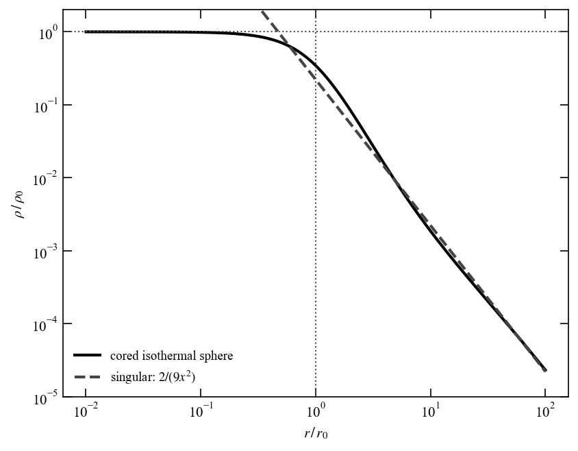

<!-- ======================= -->
<!-- PROBLEM 5.11             -->
<!-- ======================= -->
## Problem 5.11

We use the family of potentials from [Problem 2.11](chapter02.2.md#problem-211),

$$
\Phi(r) = -\frac{GM_p}{(r^p + a^p)^{1/p}} = -\frac{GM_p}{a}\,(1 + s^p)^{-1/p}, \qquad s \equiv r/a,
$$

with the self-consistent density and radial force found there,

$$
\rho(r) = \frac{M_p(p+1)}{4\pi a^3}\,\frac{s^{p-2}}{(1 + s^p)^{2 + 1/p}}, \qquad
\frac{d\Phi}{dr} = \frac{GM_p}{a^2}\,\frac{s^{p-1}}{(1 + s^p)^{1 + 1/p}}.
$$

### Jeans equation

For a non-rotating spherical system with constant $\beta$, the Jeans equation (5.47) with tracer density $\nu = \rho$ has the integrating factor $r^{2\beta}$, since

$$
\frac{d}{dr}\!\left(r^{2\beta}\rho\,\sigma_r^2\right)
= r^{2\beta}\left[\frac{d(\rho\,\sigma_r^2)}{dr} + \frac{2\beta}{r}\rho\,\sigma_r^2\right]
= -r^{2\beta}\rho\,\frac{d\Phi}{dr}.
$$

Assuming $\rho\,\sigma_r^2 \to 0$ as $r \to \infty$

$$
\rho\,\sigma_r^2(r) = r^{-2\beta}\int_r^\infty dr'\, r'^{\,2\beta}\,\rho(r')\,\frac{d\Phi}{dr'}.
$$

### Fix beta

With $2\beta = 2 - p$,

$$
\int_r^\infty dr'\, r'^{\,2\beta}\,\rho\,\frac{d\Phi}{dr'}
= \frac{GM_p^2(p+1)}{4\pi}\,a^{-2-p}\int_s^\infty ds'\,\frac{s'^{\,p-1}}{(1 + s'^p)^{3 + 2/p}}.
$$

Substituting $u = 1 + s'^p$ (so $s'^{\,p-1}\,ds' = du/p$) makes the integral elementary:

$$
\int_s^\infty ds'\,\frac{s'^{\,p-1}}{(1 + s'^p)^{3 + 2/p}}
= \frac{1}{p}\int_{1+s^p}^\infty \frac{du}{u^{3 + 2/p}}
= \frac{1}{2(p+1)}\,(1 + s^p)^{-(2 + 2/p)}.
$$

Hence $\rho\,\sigma_r^2 = r^{-2\beta}\times(\cdots)$ with $r^{-2\beta} = a^{p-2} s^{p-2}$ gives

$$
\rho\,\sigma_r^2(r) = \frac{GM_p^2}{8\pi a^4}\,\frac{s^{p-2}}{(1 + s^p)^{2 + 2/p}}.
$$

### Radial dispersion
Dividing by $\rho$, the $s^{p-2}$ cancels and the powers of $(1 + s^p)$ leave $-1/p$:

$$
\sigma_r^2(r) = \frac{GM_p}{2(p+1)\,a}\,(1 + s^p)^{-1/p}
= \frac{GM_p}{2(p+1)\,(r^p + a^p)^{1/p}}
= \frac{|\Phi(r)|}{2(p+1)}.
$$

The radial dispersion simply tracks the local potential depth.

### Tangential dispersion

Constant anisotropy $\beta = 1 - (\sigma_\theta^2 + \sigma_\phi^2)/(2\sigma_r^2)$ with $\sigma_\theta^2 = \sigma_\phi^2$ gives one tangential component $\sigma_\theta^2 = \sigma_\phi^2 = (1 - \beta)\,\sigma_r^2$. Here $1 - \beta = p/2$, so

$$
\sigma_\theta^2 = \sigma_\phi^2 = \frac{p}{2}\,\sigma_r^2
= \frac{GM_p\,p}{4(p+1)\,(r^p + a^p)^{1/p}},
$$

and the full tangential dispersion is $\overline{v_\theta^2} + \overline{v_\phi^2} = p\,\sigma_r^2$.

### Sanity check
For $p = 2$ the potential is Plummer's, $\beta = 0$ (isotropic), and $\sigma_r^2 = GM_p/[6\sqrt{r^2 + a^2}]$, the standard Plummer dispersion.


<!-- ======================= -->
<!-- PROBLEM 5.12             -->
<!-- ======================= -->
## Problem 5.12

### Part a: Cored isothermal sphere

Start from Eqn. (5.70)

$$
\frac{\sigma^2}{r^2}\frac{d}{dr}\!\left(r^2\,\frac{d\ln\rho}{dr}\right) = -4\pi G\,\rho.
$$

Let $y = \ln(\rho/\rho_0)$ with $\rho_0 = \rho(0)$, so $\rho = \rho_0 e^y$ and $d\ln\rho/dr = dy/dr$. With $x = r/r_0$ this becomes

$$
\frac{\sigma^2}{r_0^2}\,\frac{1}{x^2}\frac{d}{dx}\!\left(x^2\frac{dy}{dx}\right) = -4\pi G\,\rho_0\, e^y.
$$

Multiplying by $r_0^2/\sigma^2$ and using $r_0^2 = 9\sigma^2/(4\pi G\rho_0)$, the prefactor becomes $4\pi G\rho_0 r_0^2/\sigma^2 = 9$:

$$
\frac{1}{x^2}\frac{d}{dx}\!\left(x^2\frac{dy}{dx}\right) = -9\,e^y,
\qquad y(0) = 0,\quad y'(0) = 0.
$$

The core boundary conditions $\rho(0) = \rho_0$ and $\rho'(0) = 0$ translate into $y(0) = 0$ and $y'(0) = \rho'(0)/\rho_0 = 0$.
The rescaled equation and its boundary conditions contain **no** free parameters: $\rho_0$ and $\sigma$ have been scaled entirely into $\rho_0$ and $r_0$. Its solution $y(x)$ is therefore a single universal function, and any cored isothermal sphere is obtained from it by rescaling,

$$
\rho(r) = \rho_0\, f\!\left(\frac{r}{r_0}\right), \qquad f(x) = e^{y(x)},
$$

so the family is one-parameter (fixed by $\rho_0$, with $\sigma$ setting $r_0$). Writing the equation directly for $f$ (using $y = \ln f$, $y' = f'/f$, $e^y = f$),

$$
\frac{1}{x^2}\frac{d}{dx}\!\left(x^2\,\frac{f'(x)}{f(x)}\right) = -9\,f(x),
\qquad f(0) = 1,\quad f'(0) = 0,
$$

equivalently $f''/f - (f'/f)^2 + (2/x)(f'/f) + 9 f = 0$.

### Part b: Numerical solution

The equation has no closed-form solution, so we integrate it outward. Writing $y = \ln f$ as the first-order system $y' = w$, $w' = -9 e^y - (2/x)\,w$, the only difficulty is the $2/x$ term at the origin. We sidestep it by starting the integration at a small $x_0$ using the core series fixed by the boundary conditions,

$$
y(x) = -\frac{3}{2}x^2 + \frac{27}{40}x^4 + \cdots,
$$

and then integrate to large $x$ with `scipy.integrate.solve_ivp`. The density profile is $\rho/\rho_0 = f(x) = e^{y(x)}$.

```python
from galactic_dynamics_bovy.chapter05.cored_isothermal_sphere import plot_cored_isothermal_sphere
plot_cored_isothermal_sphere()
```



*Figure 5.12: Density profile of the cored isothermal sphere (solid) compared with the singular isothermal sphere $f_{\mathrm{sing}} = 2/(9x^2)$ (dashed).*

The comparison shows the two ways the boundary condition matters:

- **Inside $r_0$:** the cored solution flattens to a constant-density core, $\rho \to \rho_0$, whereas the singular sphere diverges as $r^{-2}$. This is exactly what the core boundary condition $\rho'(0) = 0$ buys us.
- **Outside a few $r_0$:** the cored profile converges onto the singular $r^{-2}$ law. In fact $f\,x^2$ approaches $2/9$ in a slowly damped oscillation about the singular solution, so the singular isothermal sphere is the large-radius attractor of every cored solution. The mass still diverges logarithmically at large $r$, so like the singular sphere the cored isothermal sphere must be truncated to give a finite-mass model.
