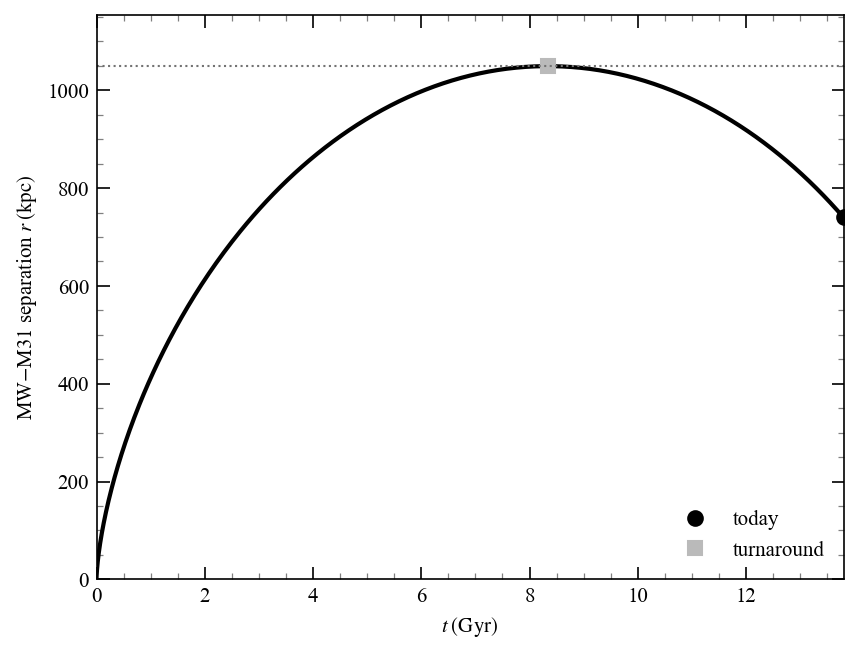

# Chapter 6: Masses of spherical stellar systems

<!-- ======================= -->
<!-- PROBLEM 6.1             -->
<!-- ======================= -->
## Problem 6.1

From Eqns. (6.12) and (2.24)

$$
M(<r) = -\frac{r\,\sigma_r^2}{G}\left(\frac{d\ln\nu}{d\ln r} + \frac{d\ln\sigma_r^2}{d\ln r} + 2\beta\right).
$$

For the Milky Way halo BHB sample [@xue2008], the tracer number density falls as $\nu \propto r^{-\gamma}$ with $\gamma = 3.5$, so $d\ln\nu/d\ln r = -3.5$. Taking $\sigma_r \approx$ const removes the dispersion term, $d\ln\sigma_r^2/d\ln r = 0$, leaving

$$
M(<r) = \frac{r\,\sigma_r^2}{G}\,(\gamma - 2\beta) = \frac{r\,\sigma_r^2}{G}\,(3.5 - 2\beta).
$$

And from here

$$
\frac{dM}{dr} = \frac{\sigma_r^2}{G}\,(3.5 - 2\beta).
$$

For the enclosed mass not to increase we need $dM/dr \le 0$, i.e.

$$
\gamma - 2\beta \le 0 \quad\Longrightarrow\quad \beta \ge \frac{\gamma}{2} = 1.75.
$$

Which is not possible since $\beta$ is bounded above by $\beta = 1$.

<!-- ======================= -->
<!-- PROBLEM 6.2             -->
<!-- ======================= -->
## Problem 6.2

$$
M_{1/2} = \frac{4\,\sigma_{\mathrm{los}}^2\,R_e}{G}
\approx 930\,\left(\frac{\sigma_{\mathrm{los}}}{\mathrm{km\,s^{-1}}}\right)^2\left(\frac{R_e}{\mathrm{pc}}\right)\,M_\odot,
$$

using $G = 4.30\times10^{-3}\,\mathrm{pc}\,(\mathrm{km/s})^2/M_\odot$. With $\sigma_{\mathrm{los}} \approx 4\,\mathrm{km\,s^{-1}}$ and $R_e \approx 5\,\mathrm{pc}$,

$$
M_{1/2} \approx 930 \times 4^2 \times 5 \approx 7.4\times10^{4}\,M_\odot,
$$

and the total mass is about twice this (the half-light radius encloses half the tracers),

$$
M_{\mathrm{tot}} \approx 2\,M_{1/2} \approx 1.5\times10^{5}\,M_\odot.
$$

Milky Way globular clusters have half-light radii of a few pc and masses $\sim10^4$-$10^6\,M_\odot$ [@harris1996], which puts the $R_e \approx 5\,\mathrm{pc}$ in the GC regime. Dwarf galaxies are far more extended — Local Group dwarfs have $R_e \gtrsim 100\,\mathrm{pc}$, with even the smallest ultra-faints rarely below $\sim30\,\mathrm{pc}$ [@mcconnachie2012], and dwarf spheroidals appear to have a characteristic size floor near $\sim100$-$120\,\mathrm{pc}$ [@gilmore2007]. A few-pc system therefore cannot be a dwarf galaxy.

<!-- ======================= -->
<!-- PROBLEM 6.3             -->
<!-- ======================= -->
## Problem 6.3

Yes. Different tracer populations sit in the same gravitational potential, so they all probe the same enclosed-mass profile $M(<r)$. The Wolf estimator ties each population's observables to that common mass at its own half-light radius,

$$
M(<r_{1/2,i}) = \frac{3\,\sigma_{\mathrm{los},i}^2\,r_{1/2,i}}{G},
$$

so once $M(<r)$ is fixed by the density profile, $\sigma_{\mathrm{los}}$ and $r_{1/2}$ are no longer independent across populations.

For a cusp $\rho(r) = A/r$ the enclosed mass is

$$
M(<r) = \int_0^r dr'\, 4\pi r'^2\,\frac{A}{r'} = 4\pi A\int_0^r dr'\, r' = 2\pi A\,r^2,
$$

so $M(<r) \propto r^2$. Equating this to the Wolf mass at each population's half-light radius,

$$
\frac{3\,\sigma_{\mathrm{los}}^2\,r_{1/2}}{G} = 2\pi A\,r_{1/2}^2
\quad\Longrightarrow\quad
\sigma_{\mathrm{los}}^2 = \frac{2\pi A G}{3}\,r_{1/2},
$$

that is,

$$
\sigma_{\mathrm{los}} \propto r_{1/2}^{1/2}.
$$

All tracer populations of the same cusped system must therefore lie on a single $\sigma_{\mathrm{los}}^2 \propto r_{1/2}$ relation, whose slope $2\pi A G/3$ measures the cusp amplitude $A$.

<!-- ======================= -->
<!-- PROBLEM 6.4             -->
<!-- ======================= -->
## Problem 6.4

For an isotropic spherical system the Jeans equation is $d(\rho\sigma_r^2)/dr = -\rho\,GM(<r)/r^2$, which can be integrated as

$$
\rho(r)\,\sigma_r^2(r) = \int_r^\infty dr'\, \rho(r')\,\frac{GM(<r')}{r'^2}. \tag{6.4.1}
$$

Take the inner cusp $\rho(r) = A\,r^{-\alpha}$ with $1 \lesssim \alpha \lesssim 1.5$. The enclosed mass near the center is

$$
M(<r) = \int_0^r dr'\, 4\pi r'^2\,A\,r'^{-\alpha} = \frac{4\pi A}{3-\alpha}\,r^{3-\alpha},
$$

finite since $\alpha < 3$. The integrand of Eqn. (6.4.1) is then

$$
\rho(r')\,\frac{GM(<r')}{r'^2}
= A\,r'^{-\alpha}\cdot\frac{G}{r'^2}\,\frac{4\pi A}{3-\alpha}\,r'^{3-\alpha}
= \frac{4\pi G A^2}{3-\alpha}\,r'^{\,1-2\alpha}.
$$

For $\alpha > 1$ the exponent $1-2\alpha < -1$, so the integral is dominated by its lower limit as $r\to0$:

$$
\rho\,\sigma_r^2(r) \;\xrightarrow[r\to0]{}\; \frac{4\pi G A^2}{(3-\alpha)(2\alpha-2)}\,r^{\,2-2\alpha}.
$$

Dividing by $\rho = A\,r^{-\alpha}$ gives the dispersion,

$$
\sigma_r^2(r) \;\xrightarrow[r\to0]{}\; \frac{4\pi G A}{(3-\alpha)(2\alpha-2)}\,r^{\,2-\alpha},
\qquad\text{i.e.}\qquad
\sigma_r \propto r^{(2-\alpha)/2}.
$$

Since $\alpha < 2$ for these weak cusps, the exponent $2-\alpha > 0$ and therefore

$$
\lim_{r\to0}\sigma_r = 0.
$$

(The marginal case $\alpha = 1$ gives $\rho\sigma_r^2 \propto -\ln r$ and $\sigma_r^2 \propto r\ln(1/r) \to 0$, so the conclusion still holds.)

<!-- ======================= -->
<!-- PROBLEM 6.5             -->
<!-- ======================= -->
## Problem 6.5

Start with

$$
r(\eta) = a\,(1 - \cos\eta), \qquad
t(\eta) = \sqrt{\frac{a^3}{GM}}\,(\eta - \sin\eta),
$$

with present-day radial velocity

$$
v = \frac{dr}{dt} = \sqrt{\frac{GM}{a}}\,\frac{\sin\eta}{1 - \cos\eta}.
$$

Eliminating $a$ and $M$ from the three relations produces

$$
\frac{v\,t}{r} = \frac{\sin\eta\,(\eta - \sin\eta)}{(1 - \cos\eta)^2}.
$$

The pair is approaching ($v < 0$), so it is past turnaround on the infalling branch $\eta \in (\pi, 2\pi)$. With $r = 740\,\mathrm{kpc}$, $v = -125\,\mathrm{km\,s^{-1}}$, and $t = 13.8\,\mathrm{Gyr}$, the dimensionless ratio is $v t/r \approx -2.384$, which gives

$$
\eta \approx 4.289\,\mathrm{rad}\ (245.8^\circ).
$$

The semi-major axis is $a = r/(1 - \cos\eta) \approx 525\,\mathrm{kpc}$, and the total mass follows from $t(\eta)$:

$$
M = \frac{a^3\,(\eta - \sin\eta)^2}{G\,t^2} \approx 4.6\times10^{12}\,M_\odot.
$$

The maximum past separation is the apocenter, reached at turnaround ($\eta = \pi$):

$$
r_{\max} = 2a \approx 1050\,\mathrm{kpc}.
$$

So in this model the MW and M31 separated to about $1.05\,\mathrm{Mpc}$ roughly $8\,\mathrm{Gyr}$ ago before turning around and falling back to today's $740\,\mathrm{kpc}$.

```python
from galactic_dynamics_bovy.chapter06.local_group_timing import plot_local_group_timing
plot_local_group_timing()
```



*Figure 6.5: The MW-M31 separation over cosmic time for the best-fit radial orbit. The separation grows from zero at the Big Bang to the turnaround at $r_{\max} \approx 1050\,\mathrm{kpc}$, then falls back to the observed $740\,\mathrm{kpc}$ today, where the two galaxies are approaching at $125\,\mathrm{km\,s^{-1}}$.*
